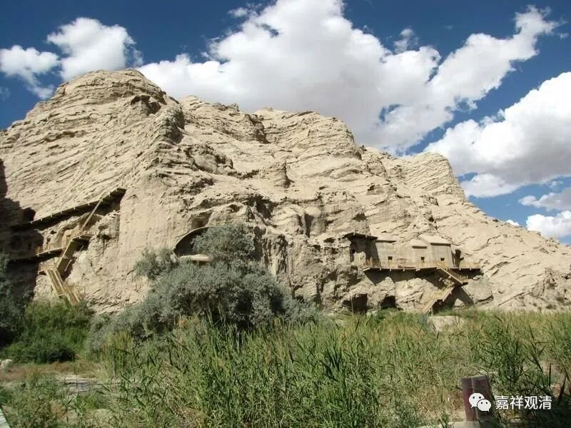

**《微课堂佛教史》030·1**

我们继续佛教史。讲到现在已经有些日子了，中间休息了一个礼拜。

我们已经讲到鸠摩罗什法师来中国之前的汉地佛教，几乎可以说，是为他量身定制了一个社会环境。当时的中国佛教界其实是非常希望有一个比较清晰的理路，可以说，鸠摩罗什法师是第一位成建制地将佛教以学派的形式带到中国的，他带给中国的是一个很完整、很全面的佛教宗派——中观派。

我们可以从鸠摩罗什法师所翻译的经典来看，里面有戒律的部分——他曾经很完整地翻译了戒律，也包括了禅定——他翻译了一些禅经，还有这些中观派最重要的著作。此外就是，我们现在所提到的所有的最重要的大乘佛教的经典，鸠摩罗什法师几乎是翻译过了全部或者其中的部分。比如说《华严经》，最重要的就是《十地品》，鸠摩罗什法师翻译过。《妙法莲华经》，鸠摩罗什法师翻译过。不管在他之前有没有译本，鸠摩罗什法师都翻译了。

以鸠摩罗什法师作为一个“划时代代”的人物来说，中国的佛经翻译在鸠摩罗什法师之前的可以称为古译，从鸠摩罗什法师开始就称为旧译。我们可以看到，他的翻译和以前的风格是很不同的，文字也非常地漂亮，主要是因为当时帮他润文的那些人都是佛教界的大家，文字水平都非常好，像僧肇法师、僧睿法师等等。

那我们先来看一下鸠摩罗什法师的历史，可能有些人已经看过不少东西了。鸠摩罗什法师呢，出生在库车，我们现在是库车，以前是叫龟兹的。我也碰到一些人把龟兹念作“guizi”的，但老实说，“qiuci”这个发音对不对也还是有问题的。现在就有人认为其实“qiuci”这个念法还是不对的，应该接近念作“kuche”。

鸠摩罗什法师的母亲在当时是一位公主，他母亲到底漂亮不漂亮我们不知道，但能够肯定的是，她很有性格。鸠摩罗什法师的父亲原先是西北印度的人，叫鸠摩炎。《天龙八部》里面有个人的名字叫鸠摩智，我小时候以为鸠摩智就是鸠摩罗什法师，后来看看好像不是的……鸠摩，翻译过来就是童的意思。

