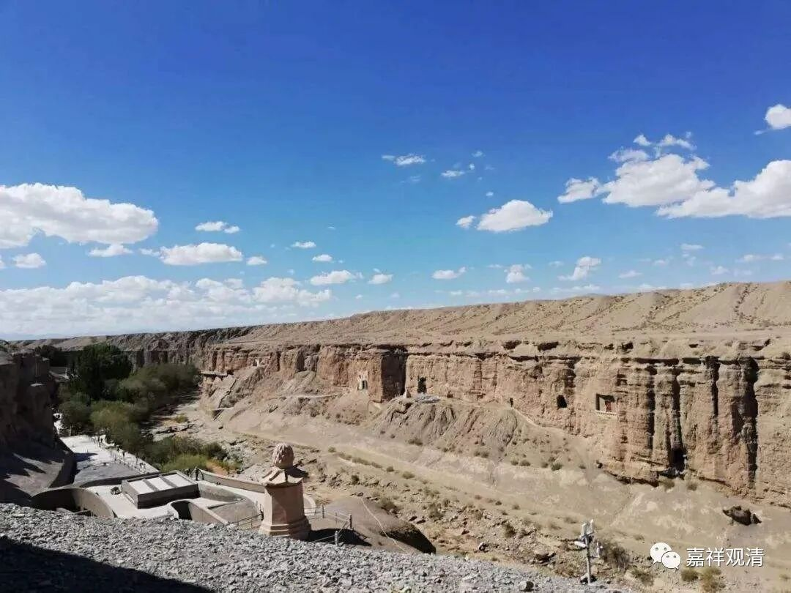

**《微课中观史》30·2**

鸠摩炎据说也是一个印度的王族，后来发生了一些变故，他就逃到中国新疆的库车。他是一个出家人，据说长得很帅，万人迷。（我们现在可以看到鸠摩罗什法师年轻时候的造像也搞得很帅的样子。因为他的父亲很帅，所以估计他也很帅。）鸠摩炎当时已经出家了，到了新疆的库车。很有趣的一件事情就是，他一出名就被公主看上了，公主非要嫁给他不可。他不同意，公主就寻死觅活的，就像一般人碰到这种情况一样，一哭二闹三上吊。后来鸠摩炎就没办法，被逼还俗了，至于被逼成什么样子也不知道，反正就是还俗了，生下了一个小孩叫鸠摩罗什。

现在看起来，鸠摩炎这个人的主要功能可能就是要成为鸠摩罗什法师他爹。因为后来他就碰到了一个非常狗血的事情，鸠摩罗什法师出生以后，他的老婆——也就是那个公主，要和他离婚，说她要出家了。那这事情就很冤枉了，人家一个和尚本来好好的，被她逼得还俗了，然后结婚生子，准备好好地过世俗的生活了，她却要出家了，搞得人家下不来台。但最后鸠摩炎也没办法，还不得不同意，于是鸠摩罗什法师的母亲就这样出家了。

其实也有点奇怪，为什么鸠摩罗什法师他爹不能再出家一回，反正书上没写，他爹就是没再出家，据说是当了大臣了……整件事等于国王用一个公主换了一个大臣。

那么，他母亲出家了，而且还把小孩也一起带出去，一起出家。据说鸠摩罗什法师的母亲后来是证了三果的，好像是在某个时间段先证了二果，然后在圆寂前证了三果，三果就是不还果了。都是证果的圣人了，我们就随喜吧……

鸠摩罗什法师的出身就相当于印度的王族，其实王族究竟是哪种王族也很难说，说不定就是刹帝利种姓而已。另外一方面，他又是龟兹的王族，所以他就得到比较好的教育，可以说获得了当时很好的僧伽或者僧团的教育，他年纪非常小的时候就出名了。当时中国的西域地区比较流行的佛教部派就是我们现在说的有部，在有部的背景下，鸠摩罗什法师拜了很多当时的大师，拜了大师以后，他学习肯定很努力，很快就出名了。

之后，由于他父亲本身是印度人，鸠摩罗什法师就去到了西北印度的克什米尔地区。克什米尔地区可以说是有部的重中之重的重心，这也是梵文比较发达的地区，本来有部也是比较多用梵文的。鸠摩罗什法师就到那里去学习梵文，学习有部，学得也是非常好，名气也非常大。

