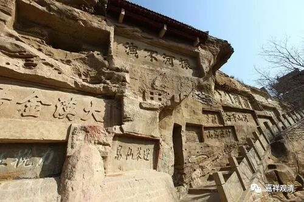

**《微课中观史》30·3**

克什米尔那个时候是有部的中心，国王推崇（好像已经提到好几个国王了）。国王的堂弟是派内顶尖高手，知识渊博（有部的《大毗婆沙》本身也表现为渊博）。小罗什便拜在大师门下，学习阿含。由于非常聪明，大师就经常给国王提起，国王请到宫里，跟其他宗教的大师辩论。

小朋友嘛，大家也没当回事儿，结果他抓到对方的漏洞，把外道高手驳倒了，对方很没面子，小罗什却挣了名声。这样，国王每天给小罗什专门一份特别优厚的供奉。这应该有几个意思：少年高手，又是自己兄弟佛教大师推荐，还是邻国国王的外孙，这份供养必须优厚啊。我要是三月半的叔叔在泰国寺院学习，又有点本事，那也是必须待遇优厚啊。

十二岁的时候，公主妈妈就带他回库车，西域各国争相礼请，小罗什不愿意去。我估计啊，是他妈不同意。他妈也是个很有主意的人，修行也很正统，不久就证二果了，后来离开罗什又去了克什米尔，证了三果……所以，咳咳，我们不敢乱说话啊。

罗什的母亲带他去见了一位大师，大师预言，（这个预言对我们来说蛮重要的，）说：这孩子要好好保护，如果在三十五岁以前不破戒，就是一代大师，度人无数。如果在这之前破戒了，就只能是一个聪明的法师罢了。

所以我们做《罗什年谱》，几乎都要凑这个35岁，因为，我们更愿意看到那位大师的预言应验嘛。另一方面，罗什也确实了不起啊，这不是吹的，看他留下来的东西就知道。罗什大师后来两次（吕光一次，姚兴一次）被迫还俗，这是事实，但大师的功业也是事实。

两次被逼取妻，很倒霉，吕光是不信佛的，那也是个说法；姚兴是信佛的，也逼他还俗，理由很“科学”、很“唯物”——这么聪明的人，基因不能白白浪费了，留个种，传下来！姚兴也是，你要留种，也应该是士大夫的门阀士女不是，你送十个宫女是啥说法？罗什后人也做了官，但没啥赫赫之功，算是白费了国王的心思，估计呢，是宫女的基因污染了血脉。

（我们所以为的）基因，这个东西很难说啦，我们心理学老师说，他们夫妻俩留洋博士，还是专业儿童心理学方向的，生出个孩子学渣渣，看到学校老师没脾气……

