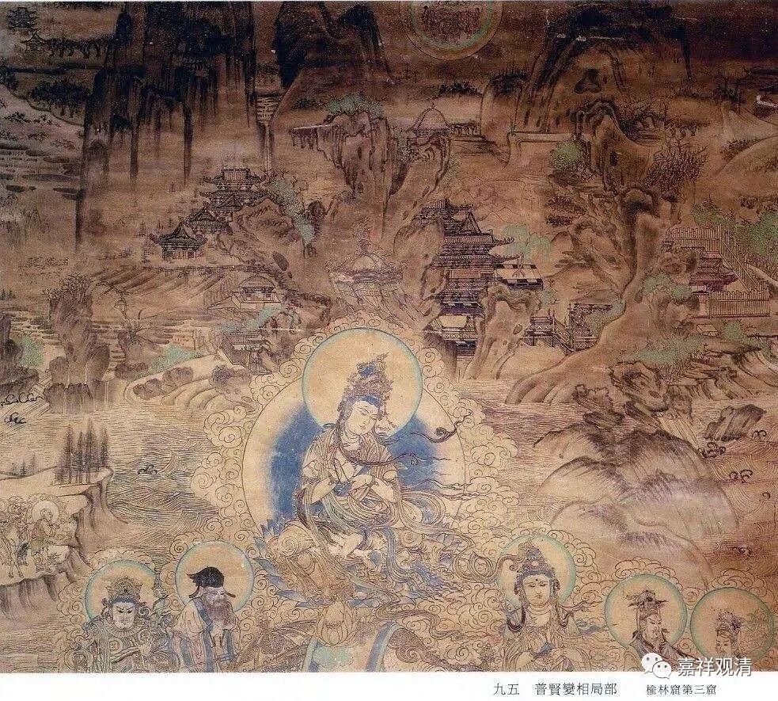

**《微课中观史》30·4**

接着，十几岁的罗什又被妈妈带到疏勒国。疏勒，又称沙勒，就是今天新疆的喀什。当时疏勒国有一个佛钵，据称就是佛陀用的那只。这个钵很有名，西行求法的僧人都会去那里顶戴佛钵。据传说，这个佛钵在佛经里授记过，此钵先到西域一带，以后会被迎请到到中国中原一带……但最后这个佛钵不知所终，并没有传入我国中原地区……关于这个佛钵，后来还出现了一部伪经……

罗什来到疏勒国，也去顶戴了佛钵。这个佛钵是石头做的，钵的外壁还挺厚，有四个褶皱。传说是因为四大天王各供养佛一个石钵，佛为了让四大天王都高兴，全都接受下来，但因为一个比丘只能有一个钵，所以释迦佛就把四个钵合为一个，所以这个石钵的壁沿可以明显地看出有四层。

佛钵顶在脑袋上（估计是有专人看管，他去取来让信众顶戴），小罗什觉得也不咋重嘛……这么一想，突然觉得很重，失声叫出来。他妈问他“怎么了？”，他说：“心有分别，钵现轻重。”（我猜就是人家看到小孩子，就先轻轻放到脑袋上，摆正了以后就卸了力，所以先轻后重……我是不是太唯物了？……）

前面说过，当时西域这一带都是有部的重镇，有部的教区，因为地域上也和克什米尔接壤嘛。小罗什到了疏勒国就住了下来，专学有部的阿毗达摩，包括一身六足论。“一身六足论”就是：首先，“一身”指迦多衍尼子的《发智论》，“六足”即，《集异门足论》、《法蕴足论》、《施设足论》、《识身足论》、《界身足论》和《品类足论》。这是有部的核心论典。据说小罗什也是一学就会，对其中的一些诸门分别，类似今天的习题部分，也都辨析无碍。

隔壁国家国王的御外孙来学得这么好，就受到疏勒国国师的关注。国师找到大王进言：某某小沙弥挺有能力的，学得不错。我看您可以请这位小沙弥登大法座开讲佛经，搞一个大法会。这样有两个好处。其一呢，国内的出家人看到一个小沙弥能受国王礼请登高座讲经，也会生惭愧、羡慕之心，人人都会努力；第二呢，你请龟兹国的外孙开座讲经，人家国王就知道您这是示好，我们不就缔结了友好邦交了嘛！

疏勒国王一听，是这么个道理啊！就同意了。就请罗什沙弥升座讲法。果然，龟兹国国王噶出苗头来了，遂派出重要使节，缔结邦交，成就一段和平佳话。你看，人家小罗什生得好，佛教里叫“种姓圆满”，国王的外孙，结果轻轻松松就积累下了我们想都想不到的大福报。

