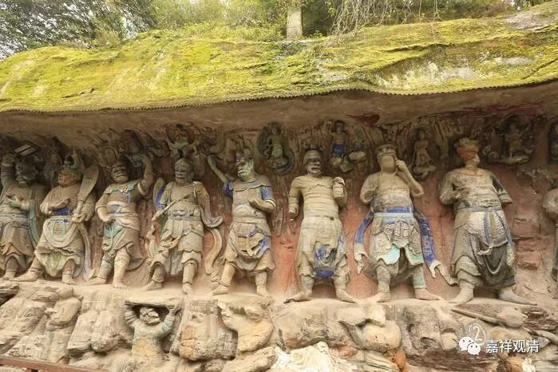

**《微课中观史》30·5**

当时有莎车王子兄弟二人也在疏勒国。此二人在疏勒国非常有地位，举国沙门皆从而受戒。其中弟弟专门弘扬大乘中观学说，其兄长也在他座下听法。小罗什也跟着这两位大师学习经教。（又是王族，又是中观祖师……中观派的祖师好像都是王族嘛……）

小罗什之前学的是有部正宗，突然学到大乘中观，颇有点不适应。看到经典里说蕴界处皆空无相，就奇怪了，说：“这部经有什么密义吗？这么说岂不是破坏诸法吗？”莎车王子回答说：“没错啊，经文可以如言取义。眼等一切法皆非真实有！”于是罗什取声闻部宗义执有眼根，苏摩王子据理破之，成立非实有。两人这样反复辨析，经历了一段时间以后，罗什终于明白了佛陀的终极意趣，专致学习中观学说。《中论》《百论》《十二门论》等尽皆研习。

所以我们一直强调，学习佛教应该要有阿毗达摩的基础。罗什年少时就打下了很好的有部的阿毗达摩的基础，再学中观，基础就特别扎实。你对有部、唯识、经部这些的宗义理清了，对你学习中观是很有帮助的，你知道中观的着眼点在什么地方，而不是向空挥舞大刀。

罗什大师后来说了一句很令人惋惜的话，他说他非常想写一部中观的阿毗达摩，可惜没有时间了。很可惜啊，中观真的很缺这样一部专宗的阿毗达摩。

此后，罗什又跟着妈妈来到了温宿，温宿是古西域三十六国之一姑墨国所在地，在今天阿克苏以北的温宿县，和龟兹国北边接壤。这个地方正好有一个大外道，学问不错，名气很大，在国王面前放出话，说：“拿我的脑袋做赌注，谁要是辩论赢我，我脑袋输给他！”罗什来了，两厢辩论，外道折服而皈依（这也是中观派的套路，脑袋不要，输信仰就行了，不然我还要算杀生）。

于是小小年纪，名声遍于西域。外公龟兹国王亲自去温宿把他接回来，并在龟兹国升座讲法，四方莫能相抗。这时候，他还没到二十岁啊！我二十岁前……在学立体几何呢。不过我出名也不晚……

