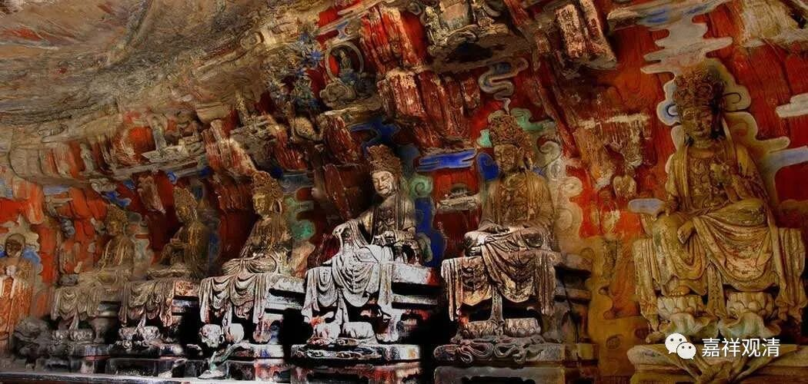

**《善说精髓》084（98）**

** “若我与蕴自性异，可见然不为量缘；”**

** **

前面说我与蕴自性一不成，此下抉择自性异。在《略论》我与蕴“自性一”与“自性异”是分开的两个科判，在本论则在一个科判底下——宗法扼要：“见难二成”。内容上二论没有差异。

对方许补特伽罗由自性有，与蕴为一，见此终不能成立，于是反过来，执：既然你说我与蕴自性“一”不成立，则当成立自性异！

自宗说：“** 若**”许“** 我与蕴自性异**”，那么，既然是独立于五蕴的我，应该可以找出来，应该“** 可见**”。这里的“可见”就是可以被认识到的意思。但是，这种独立于五蕴的我，我们的心缘不到——“** 然**”而“** 不**”能“** 为量缘**”到，不能被认识到。

这里有个公案。当年陈那（因明学大师）最初学的是犊子部，犊子部说“我”是“非即蕴非离蕴”的存在，一般外人也难为他反对“即蕴我”就说他是“离蕴我”。陈那在犊子派那里打坐，不安分，东张西望。师父问他：“你干嘛呢？！”“我找‘我’呀，离了五蕴，应该能被找到呀……”于是被赶出教派。以前佛教各部派的核心观点是不允许初学质疑的。所以你看，这里的文字也是陈那的“** 然不为量缘**”，量找不到。

佛教各宗阿毗达摩里，有为法就是五蕴都包括了，如果我与蕴自性异，那要么不存在，要么是无为法。我如果是无为法，那我们还修个啥，心心念念要证无为法，现在“我本来就是无为法”了，那不是折腾吗？这就是——

** “蕴具生住灭等相，我不具故成常等。”**

** **

五** “蕴”**是有为法，** “具”**备** “生住灭等相”，“我”**如果与五蕴为异，则应该** “不具”**备有为法的生灭相，那他不是变“** 成常法**”——无为法——了吗？那还修个冇啊！自性成就啦！不修就成就啦。

而且我们说“轮回苦”，苦的是什么？究竟一切“五取蕴苦”啊！现在好了，五蕴归五蕴，我归我，我还“苦”啥呢？应该根本碰不到半点苦才是！但事实呢，大家自己看苦不苦……

