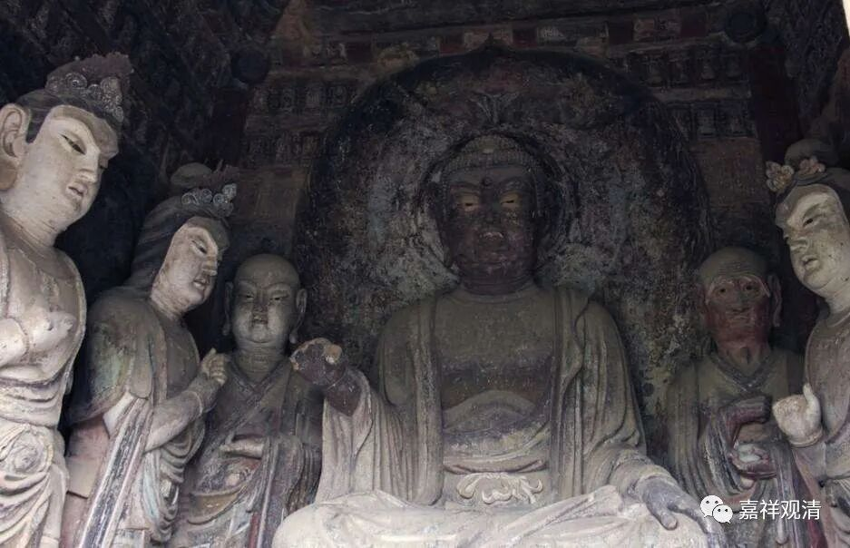

**《微课中观史》30·7**

这样，罗什和盘头达多师徒二人就开始了龟兹国第一届国际佛教学术论坛，与会嘉宾舌战交锋，一定要得出一个所以然来。

师父问罗什：“你到底看到大乘什么好了，而改宗易辙，顶戴奉行？”

罗什说：“大乘（中观）义理深远，明一切皆空；小乘（有部）思想固化，概念上的展开过于繁复……”

盘头达多大师说：“你说的‘一切皆空’，真是可怕！瞪着眼睛把面前的一切存在都说没了！这只是喜欢空空空罢了。”

我最初接触佛教在初中三年级，到了高二的时候，接触到了佛教里说的空，当时也是把我吓死了——哇哦，本来多少还有个我在轮回，这下怎么啥都没了？吓得我看见寺院绕着走。我经常去福州路、文庙，路上要经过玉佛寺和静安寺，那段时间，我宁愿绕着多骑几分钟路——怕了。好在后来又接触到三论系和格鲁系，能够对佛教的空有了点认识，真是“然近死主口，在命未尽时，于佛略生信，想亦有善根”……

盘头大师接着举了个例子，很像《皇帝的新衣》。说：以前有个人脑子不太好使，找了顶级的纺织工，要求纺出最细的纱。纺织工努力纺得最细，已经达到微尘级了，意思就是再也不能更细了。狂人来取纱，还是觉得太粗。纺织师火了！他凭空虚拟地递东西给狂人。狂人奇怪，说，你这给我的是什么？纺织工说了：我在是这里最好的工了，这是我纺的最细的纱，织出的最薄的布，我都看不见，何况你呢？狂人大喜，大赏！又拿这“料子”给裁缝。裁缝也依样画葫芦给他做了最轻的衣服，也获得大赏！

盘头大师说：“你们说的空不就是这样吗？只是单纯喜欢空而已，脑壳都坏掉了！”

于是鸠摩罗什法师就开始和师父来回分析讨论，不厌其烦，仔细剖析，来回往复了一个多月，终于把他师父给说服了，最后盘头大师说道：“‘师不能达，反启其志，’今天我算是看到了！今后，我是你小乘的师父，你是我大乘的善知识。”遂礼罗什为大乘师长！师徒二人上演了一段佳话！

盘头大师说的“师不能达，反启其志”，是一个典故。出于《太子瑞应本起经》，说的是释迦太子小时候跟师父学经典，书里面漏了俩字（估计是字母）讲不通，太子问老师，** “师不能达，反启其志”**，老师也说不上来，经过太子的启发才明白了意思。盘头大师举这个典故，来赞美罗什大师。也是有文化的人会夸人，不像我们没文化，输了辩论学了乖，就只会卖萌了。

那么，接下去的故事我们就下次再说了。反正有一个非常有趣的现象就是，早期中观派的人物在某种角度上都有点悲壮，有点倒霉。倒霉的事情我们明天再接下去讲，今天的佛教史先说到这里。谢谢大家！

