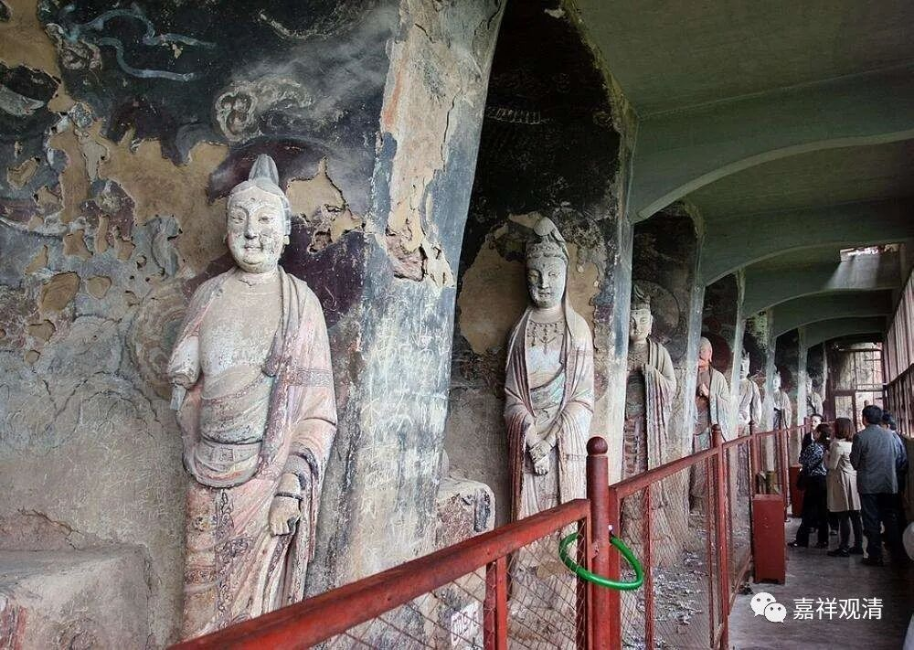

**《善说精髓》084（100）**

** “无石女儿无其眼，可知我所无自性。”**

** **

以如上观察我无自性的同样的方法，进而观察我所，则亦必见其无自性。这里举了一个佛典中常用用的例子，“石女儿”，“石女”，就是没有生育能力的女性，没有生育能力的女性自然不会有亲生的儿子（我们不讨论今天的基因工程，仅就逻辑上讨论），所以，“石女儿”（不能生育的女人正常生育的儿子）是根本不存在的，是无。明白了“石女儿”是** “无”**，那** “石女儿”的**“** 眼**”睛、人种、肤色、智力高下等也必然为** “无**”。(我最早在佛学院教中观，到了期末我才发现，整个一个班里的人没人知道啥是“石女儿”，都以为是石雕的女人……还好期末最终发现了这个问题。)

同理可知，“我”之自性为无，“我所”之自性也不可得——“我所”尚依“我”而安立，“我”既无独立自性，我所也无独立自性。这里，“石女”比于“我”，“石女儿”比之“我所”。

如《中论》说：

“若无有我者，何得有我所？”

** **

《入中论》说：

“由无作者则无业，故离我时无我所；

若见我我所皆空，诸瑜伽师得解脱。”

再以如上的观察法遍观一切，则都见其无自性。

** “安立所依安立法，自性一异安立理，**

** 以此观察诸所知，”**

** **

** “安立**”的“** 所依”**——蕴；“** 安立法**”——我，这两者** “自性一异”**的** “安立”**的正** “理”**获得以后，“** 以此**”来** “观察”“诸”**一切的** “所知”**、一切的法，则为见其都无自性，没有纤毫的事物可以自性成立。大家看《心经》、《般若经》说的都是这个——从色乃至一切种智，皆自性空寂……

** **

这时候，一般人被破到最后，都会说：那佛经里这里那里明明说有蕴界处，开示四谛、十二缘起、地道建立、究竟涅槃……你怎么解释呢？

** **

** “知为二谛生稀有。”**

** **

来来来，这要帮你分析二谛的安立了……

能够把中观的二谛搞懂，中观就算搞明白了。中观的核心是二谛说，唯识的核心是三性说。这句话要划重点，敲黑板，记住了！背下来！

