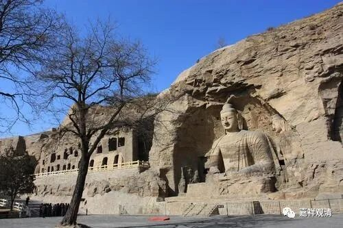

《微课堂佛教史》031·1

好，我们现在继续佛教史——大神鸠摩罗什法师的故事。那天我们讲到哪里了？再重新讲一遍也无所谓吧。

鸠摩罗什法师是在新疆库车出生的，他出生以后她的母亲就出家了，而且是带着他一起出家的。在那个时候，差不多整个新疆境内都是有部的辖教区，或者说是有部主要的弘法区域。那么，鸠摩罗什法师从小就学习有部的教法，应该说打下了扎实的基础，所以他对《阿含经》等小乘的经典就非常非常熟悉。

他差不多是七岁的时候出家的，九岁的时候就去了今天的克什米尔地区，在经典里面那个地方叫罽宾，就差不多现在的克什米尔地区吧。那个地区是有部的重镇，鸠摩罗什法师就在那里学习了好多年，主要是学习有部的教法,历史上我们比较熟悉的“根本说一切有部”，是当时这个有部的承继者。他在那里也学习了梵文。

后来鸠摩罗什法师在罽宾学成归来，到了疏勒国，又碰到了大乘的僧人，是中观派的，叫莎车王子。莎车王子、参军王子是一对兄弟，其中弟弟水平更厉害，叫苏摩。鸠摩罗什就和他们进行了辩论，辩论以后就服了，就开始学大乘的经典。他学习了《中论》、《百论》、《十二门论》等等论著，还有很多很多，不止这一点点。所以汉传的中观派就是这一系的，从莎车王子传给鸠摩罗什法师。

回到库车以后呢，鸠摩罗什法师也差不多快成年了，就开始学习戒律，然后又跟他的小乘老师盘头大师去讨论大乘的教法。我们曾经讲过，新疆在那个时候主要流行的是有部，而且离有部的根本重镇克什米尔地区也非常近。那么在这种背景下，就不可避免地会出现一些情况，就有人认为大乘非佛教。其实那个时候的大乘倒是大小乘都学的。其实龙树、圣天、无著、世亲都对声闻佛教极其熟悉，但是传到我们这里，时间一久，基础的都没人学，都去谈空说有，有没有本事，结果就是胡扯了一千多年。唐中期以后汉地的佛教基本上都在胡扯。

有一次在一个佛教论坛上，有个知名学者大谈某某古人的唯识思想blablabla，LZ法师问我：“这（古）人的书你看过吗？”“不看，丢不起这人！”LZ法师说：“唐(中期)以后，汉地自己弄出来的书还值得看吗？”我们相视一笑……

鸠摩罗什法师的老师呢，听说自己最得意的弟子——小时候就很聪明的孩子，居然去学习了大乘教法，那么他回来以后他的老师就要找他辩论。鸠摩罗什在辩论中赢了他的老师，就给他的老师讲了很多大乘的教理，反反复复，花了一个多月时间，真正地折服了他的老师。

这个事情真的是非常难得的，有两方面的难得：第一，我们能够看出小小的罗什法师的实力已经非常强了；第二，他的老师居然能够依法而不是依人，并不仰仗自己是老师的身份而端架子，还是以考虑法为主，非常难得。最后他的老师说：“我是你的小乘的老师，你是我的大乘的善知识。”

这之后，鸠摩罗什法师的名声大震，这里面也有几方面的原因：一方面，他本身是一个王族；另一方面，他的学问非常好，又从小到有部的各个地区去学习，水平又那么高，所以很快就在西域闯下了名头。

