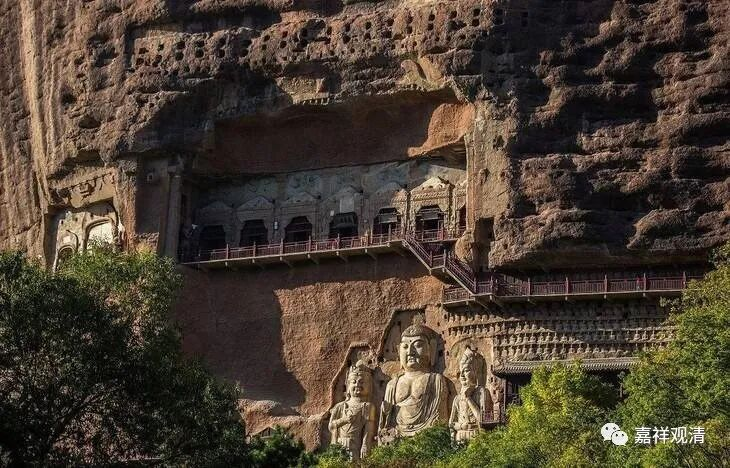

**《善说精髓》084（101）**

** “戌三、示依此补特罗显现如幻之理**

** 分二：亥一、示说如幻之义，亥二、依何方便显现如幻之理。**

** 亥一、示说如幻之义**

** 分二：干一、显现如幻之理正义，干二、显现如幻之理似义。”**

** **

下面接着讲中观的如幻义。

“如幻”，是大乘经典里面说的，所以很多宗派都讲“如幻”，唯识也有如幻，那是“加持木石”的如幻，和中观宗所说不同。中观宗里面，又有自续和应成的不同，乃至很多自诩为应成的，那种“如幻义”也是五花八门，这些人其实就是听着“应成”的名气响，什么五花八门的人都出来自称应成。

有些人分不清各宗如幻义的区别，于是笼而统之，出来做和事佬，说：“中观和唯识辩了上千年，其实老僧我看起来，都讲如幻么，一样的，巴拉巴拉巴拉。”这样说的有名的法师还不止一个，其实呢，是自己分辨不出这里面的差别。唯识和中观在“如幻”上的差别有点大哦。

唯识说，“如幻”的“幻”，就是变的戏法。如幻，是“幻师”（魔术师，不是幻视）加持木石的如幻。就是说，魔术师用木头、石片等幻（变）出人物、象、马，人物、象、马是无，木石等是有。木石是依他起，是所依事，是缘起的实有、自性有、自相有；变幻出的象、马等是无、是无自相。依他起上没有遍计所执，木石上没有象马，就是圆成实性，即唯识的空性——依他起上没有遍计所执。

** **

学中观的人不要激动，一看到“无自性”、“如幻”就兴奋地跑过去认亲戚，你看清楚，人家讲的“无自性”、“如幻”这些，名词上一样，内容根本和自宗不是一回事。唯识讲的“无自性”，是三性上的三无性：遍计所执性的相无自性；依他起性上的生无自性、及一分胜义无自性；圆成实性上的一分胜义无自性。他们讲的“无自性”、“胜义无自性”和中观的“胜义无自性”全不相干。

唯识的三种“无自性”的背后是要成立他的“三自性”。唯识说，《般若经》讲的“一切法无自性”是不了义的，是需要继续加以诠释的，怎么诠释呢？唯识就把他分为“一切法”和“无自性”：“一切法”，分成遍计所执性、依他起性和圆成实性；“无自性”，分为相无自性、生无自性和胜义无自性。加起来就是“一切法无自性”：遍计所执性的相无自性；依他起性上的生无自性、及一分胜义无自性；圆成实性上的一分胜义无自性。

对自宗来说，《般若经》的“一切法无自性”是了义说，不需要从唯识师的“三性三无性”来解释。

简单地说自宗的如幻。这里可以借用阿底峡尊者的一个比喻，很直观。阿底峡尊者说，应成的“如幻”是“加持空的如幻”——如幻的背后并无其实体有。《中论》说：“譬如幻化人，复作幻化人”，由第一个幻化人变幻出第二重的幻化人，这第二重的幻化，就是自宗的“如幻义”——幻化的背后的支撑，依旧是幻化，并无实体。

