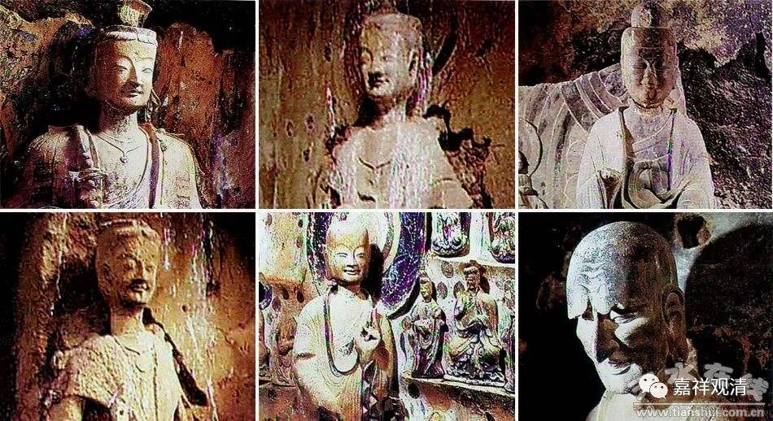

**《善说精髓》084（102）**

** “干一、显现如幻之理正义”**

这个“干一”的“干”应该是是乾坤的“乾”.（不过，天干地支用完了，不是应该排千字文么？这里直接就“乾坤”了吗？或者这个“干”应该用“天”，“天地玄黄……”。不过无所谓啦，就是科判需要一个序列符号。）

据《略论》说，此如幻义有二：胜义谛如幻，和现相如幻。

第一，胜义谛如幻。

** **

** “执自现识前无欺，有而破其谛实力，**

** 亦说涅槃如幻化；”**

** **

胜义谛，简单说就是胜义理智的所缘境。在入圣根本无分别定前无欺诳地存在，这是胜义谛，是有，但非谛实。这个“** 自**”，是圣根本无分别定的那个“** 现**”前心“** 识**”，在它面“** 前**”“** 无欺**”诳地存在，那就是胜义谛，心的境不是没有，是“** 有**”，但这种“有”非谛实有，所以要“** 破**”除它（“** 其**”）以** “谛实”**的方式（“** 力**”）而有——这种“有而非谛实”就是胜义谛的如幻。

胜义谛，就是涅槃，所以这里就是第一，胜义谛“** （涅槃）如幻化”。**

** **

《般若经》当中，善现（须菩提）在说到“涅槃如幻如化”的时候，帝释天惊到了，就此引出了须菩提的名言——“摄有一法过涅槃者，我说亦复如幻如化”。《心经》中也说：“空中……无苦集灭道……”，这里的“灭谛”，自宗许为就是胜义谛。胜义谛，有，而自性无。“胜义谛”如果没有，那证道的心就没有对象了——而这是不可能的，所以胜义谛是有；但是这个有的方式呢，不是以“谛实有的方式”而有的。这是胜义谛的如幻。

** **

第二，现相的如幻。

** **

** “如是如于识前现，无自性人色声等，**

** 现空聚故现如幻。”**

** **

在出圣根本无分别定以后，在后得位时，在心前显现的补特伽罗、色、声等一切法，虽无自性而现似实有。后得位的境——它在名言量前，显现为像是谛实有，但我们以之前胜义谛心的“余力”来观察它时，依旧见其无谛实、无自性。这种在后得位时“现似为实有”而知其为“谛实无”、“自性无”就是后得位的“如幻”、现相的如幻。眼睛看到了幻化的相，但（一分析就）知道他是假的。（这应该是八地以前后得位的现象。）这种“如幻”，叫“** 现空聚**”——如现而空。

按着意思串一下：补特伽罗、色、声等一切法，在后得位的心前虽现似为实有，但如其显现而（知其）无谛实，这就是“现相如幻”。

