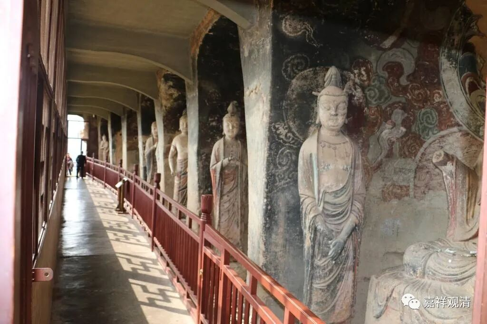

**《微课中观史》31·3**

因为当时国际贸易发达、国际间交流的缘故，鸠摩罗什法师在汉地的名气已经非常响了，所以他到了武威、张掖这一带，已经人冲着他的名气过去了。他也有点隐忍，先是忍着，然后就开始带徒弟了，也开始进行一些最初的翻译，他开始学汉文。

过了一段时间，后凉后来也凉了——把苻坚干掉的那个姚秦的姚苌又把吕光建的后凉给干掉了，这个时候，吕光已经死了。姚秦打通了河西走廊。那么他们这一家呢，是信佛的，就把鸠摩罗什法师接到了长安。然后在那里给鸠摩罗什法师专门建立了一个道场，有个名字叫“逍遥园”，在那里译经传教。

于是呢，当时四方的大师们涌入长安，佛教的饱学之士们也都往长安凑，一些年轻的僧人也都去长安，在那个时代很多很多能够走动的法师们基本上都去了长安，好像朝圣一样。南方有一些人就没有动，但是基本上能走动的都过去了，包括道生法师从苏州一带都过去了，向鸠摩罗什法师问学。也是罗什大师实力感召……

那么，鸠摩罗什法师的灾难还没结束。姚兴的确是信佛的，但是他的想法又不太一样，他觉得：“鸠摩罗什这个人实在是太聪明了，你怎么能这么了不起呢？”他有点基因决定论，有点像我们现在这样相信物质的，他就觉得这样不行。他就对鸠摩罗什法师说：“你这个聪明人的基因不能没有，你必须留下孩子。”姚兴就送给他一些宫女，逼着他必须生孩子。

不过这个基因决定论好像还不见得正确，我们在后期的一些笔记当中也看到，鸠摩罗什法师是有后人的，但是这个后人基本上没什么名气。好像是有人找到过一块碑文，上面有鸠摩罗什法师的孩子，后来官也当得不大，也没什么名气。由此可见，基因本身并不决定，还是识比较重要，心比较重要。其实儒家也是这么讲的，对吧？物质和心进行比较的话，心比较重要。有形的和无形的进行比较的话，还是无形的比较重要。熊十力好像就是这么说的。你这块石头是有形的，它的附加值是无形的，把这个附加值放到石头上去就值钱了——这就是珠宝，对吧？

我们看看啊，鸠摩罗什法师确实也挺倒霉的。作为一个小国的高僧，没有什么发言权，被人家掳来掳去的，皇帝想干嘛就干嘛。但是他也隐忍下来了，最后还成就了一番伟业，对中国佛教的发展作出了极大的贡献。

好，鸠摩罗什法师的故事今天就先讲到这里吧。

