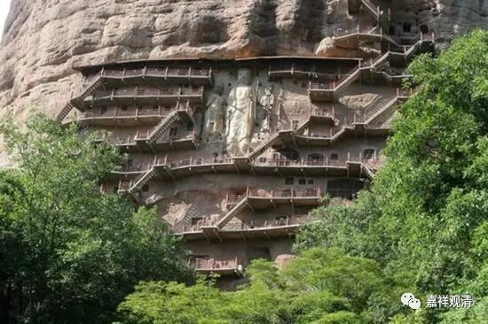

**《微课堂佛教史》032·1**

好，我们继续佛教史。先讲本门的，中观史。

现在我们已经讲到了中国佛教中观派的历史，在这当中，讲了一些类似前言、开场白的内容，然后就讲到中国佛教中观派当中最重要的一位人物。说起来这位人物还不是汉族，他应该是印度人、印度裔；或者说他是龟兹人。反正他爹是印度人，后来在新疆出生的，这么说他也可以说是中国人。（假如在贝加尔湖畔出生的李白是中国人，那库车出生的罗什也可以算中国人。不过，罗什出生的时候龟兹还未入中国的版图，不是辖区……所以，安立概念真的不容易啊。）他就是中国佛教的四大译经师之一——鸠摩罗什法师。

中国佛教的大译经师有四个人，我们来报一报吧。第一位是鸠摩罗什法师。第二位是真谛法师。真谛法师也是唯识系统的，一般我们说他是安慧法师那一系统的，有些说法就说他是安慧法师门下的。

真谛法师也翻译了很多经典，而且翻译得很完整，很可惜他在一个很动乱的年代到了中国，所以他翻译的很多东西没有保存下来。又由于他和玄奘法师的年代比较接近，所以玄奘法师翻译了一些作品和真谛大师重复，以后呢，真谛法师的一些译作就没有流传下来。

中国佛教失去的东西很多。其实现在想想，好像也不仅仅是中国的佛教，中国整个历史上都出现这样的问题。《伤寒论》也差不多失传了好几次，是吧？《黄帝内经》也有这样的问题，失传过，再整理……是吧？中国的好东西太多了，或者说中国的战乱太多。好在现在可以刨。儒家的《五经》里面，好像只有《春秋》没有佚失过……可能有关老爷保佑！

那么，第三个大译师是玄奘法师。这个大太太熟悉了。

第四个呢，我个人比较主张义净法师。但也有人说不空三藏法师，我个人对不空三藏法师有点意见，比较赞成义净法师。义净法师翻译的质量和数量都不少的，不空三藏法师翻译的质量不是很高，还有一些作品到底是不是翻译的东西呢……呵呵……

当然，“四大译经师”取不空三藏可能还有一种考虑——平衡一下各个派别，如果算义净三藏，那就是中观唯识两大派，1：3，唯识派一宗独大；如果取不空三藏，数据就要好看点，中观、唯识、密宗，1：2：1。

我们讲到了鸠摩罗什法师的一些经历：他是龟兹人——库车人，母亲是公主，嫁给了一个远方来的印度人鸠摩炎。鸠摩炎是一个很聪明的印度人，他本来还是出家人，后来被逼还俗，结婚生子，做了龟兹国相。生了孩子以后，公主又吵着要出家，然后就带着孩子出家了，她在吕光征西域之前离开龟兹国去了印度，据说最后在印度是证得三果的。

