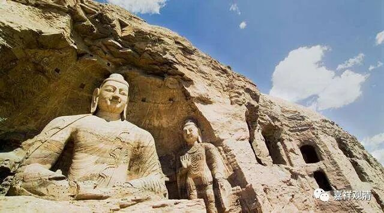

**《善说精髓》084（104）**

** “此遍所知非少分。”**

** “此”**一切法无自性，遍于一切** “所知”**，“** 非”**是针对“少分”的事物。

这里的“所知”，是指一切法、一切的存在。心是能知，一切法都是所知。有的文盲老是炫耀“不可说”“不可知”，却不知道，“不可说”“不可知”的，等于不存在！用“玄之又玄”来掩盖“无知的不能说”，才是他们玄之又玄后面的究竟真实！

“少分”的意思，是说“某些法有自性，某些法无自性”。

有人（唯识师）认为，一切法有三：遍计所执性、依他起性、圆成实性。此中，遍计所执性无自相，依他起性和圆成实性则是有自性相的。这就是所谓的“少分”。这种“空”不是中观的空。

唯识说：你们中观讲的很好，“唯名言有而无自性”，精准！但是你们要知道，这只是讲的遍计所执性。龙树破的是遍计所执性的自相有，但未涉及依他起和圆成实性，所以，破掉遍计所执性自相有，剩下的依他起和圆成实性那是实实在在的自性有啊！利根者依龙树教法，但遣除遍计所执性，遍悟到“所余”的依他起性和圆成实性非是所破，则证空性——依他起上没有遍计所执的空性——圆成实性；钝根者，不知龙树的“所遣”与“不遮”，便谓一切法都如遍计般无自性相，则误解龙树多矣！

这就是唯识的一份空、一份不空，正是本论此句的对象。

唯识和中观都认龙树为祖师，唯识系统也在注释龙树的经典。早期的无著、世亲先不谈，就是后来正式分家以后的唯识师里，大师级的，安慧有《中论释》，护法有《四百论释》。在唯识系统看来，龙树大师说的没错，但需要解释；你们中观不了解龙树密义，用力过猛，把依他起性和圆成实性也成立为无自性了，这就成为断灭空了！依他起和圆成实的无自性，只能在三性三无性的背景下，成立其“生无自性”和“胜义无自性”，究其实质，依他起性和圆成实性是实实在在的有自性的存在啊！

我们中观师有时间的可以多了解一点唯识，可以帮助我们更了解中观的自宗——在别人眼里看到自己。

