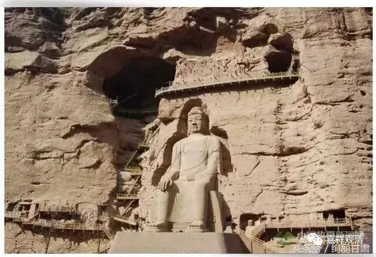

**《微课中观史》32·3**

前面我们已经铺垫过了，这个时候中国的佛教界已经知道有这样一位大师到了中国，因此全国的出家人，只要是能走的，只要是想学的，只要没庙的，基本上都过来了，从江南的到北朝的，都往长安跑。跑不了的呢？比如慧远法师，就派人带消息过来，也写信来问一些问题等等，可以想象鸠摩罗什法师在当时受欢迎、受期待的程度。

鸠摩罗什法师在武威的时候已经开始学习汉语，等他到长安的时候他的汉语水平已经可以做翻译的工作了。再加上他碰到了一个很好的时候，就是皇帝是信佛的，而且皇帝自己经常没事儿就亲自到逍遥园来主持翻译工作——拿着以前的本子，听罗什大师翻译新的本子……

很有趣的事情是，吕光这个人是不信佛的，然后就逼鸠摩罗什法师还俗。而姚兴他是信佛的，他又觉得这么好的机会不能浪费，于是送给鸠摩罗什法师十个宫女什么的。《神僧传》里面有一种很特殊的说法，说当时大家都看不起鸠摩罗什法师，然后鸠摩罗什法师就说：“如果你们也能这样的话，那你们也可以娶妻。”说完他就抓起了一把针吃下去，然后那些针又从毛孔里面出来。大家一看，叹服啊！其实《神僧传》是作不得数的，在《神僧传》里面，很多中国的义僧——义理的僧人全变成神僧了。所以大家别太相信《神僧传》里面的故事，在历史的记载当中和正统的僧传当中都没有这些东西的。

我们隔壁的藏地的这些法师们，现在有空的时候也在讲汉地的佛教，比如《高僧传》等等。他们老是喜欢把这些我们都不信的东西拿出来讲，汉人还听得挺高兴的，实际上这个不是正统的说法。《神僧传》其实是很晚很晚才出现的，这些故事是有的。但是你们如果去查这些故事的原型的时候，就会发现根本没这些故事。说真的，是挺烦人的。

你们如果去看某个高僧的故事，比如说华严宗的杜顺和尚，我曾经专门查过，他摔到河里的那件事情。早期的记载是说，他摔到河里了，然后好像是很快地就从河里面上来了。到后来慢慢地就变成：他摔到河里身上一点也不湿。再慢慢地又演变成：他摔到河里，水就退下来了。所谓的“神僧”都是这样经过“文学演变”演变出来的。在中国那么丰富的历史记载下，想从一个凡僧变成一个神僧还得要经过上千年。还好我们还有记载的，还可以去往前查历史的。所以很多《神僧传》里的故事都作不得数的。

鸠摩罗什法师也是这样的，也许他是有些神通的，到底是不是有其实我也不是很清楚。我突然想到一件事情，说不定这就是个阴谋哦，有可能哎，真的有可能……我就讲讲我的想法吧，如果这样的话，那个吞针故事是更加不可能了。他如果碰了女人，就是他有欲界的这个欲的话，还生了孩子，那他的禅定就没有了，没有禅定的话，他的神通也就不会有了。

我刚才为什么要讲这些事情呢？说不定这是一个阴谋的因。鸠摩罗什法师之前也可能是有一些神通的，他在西域能够流行，说不定还是有些神通的。逼他结婚就是要拿掉他的神通，也有可能是这样。因为在古代，有神通相当于是一种很重要的资源。突然想到，这也是有可能的。不过这只是一个题外话，我们开了个小差……

那么，逍遥园这个译场的形成应该不是事先想到的，但是这个译场就成为了之后唐代的包括玄奘法师译场在内的好几个译场的蓝本。有了这样的译场以后，大家都知道该怎么做了，都是搞成这样的一个翻译的模式，积累了很多很多的人。当时据说是有三千人，当然，这三千人当中真正有水平的估计也就是顶尖的几个，。这其中有鸠摩罗什法师弟子当中的所谓“四圣、八俊、十哲”，反正高僧都在。这一大批的人，再加上皇帝，再加上一些士大夫在里面，就组成了一个译场。这个译场的组织和以前不一样的，之前的翻译从来没有这么庞大的一个组织，此后皇家译场的规模基本上都比较大。宋代的译场相对来说就小多了，唐代的译场都非常地大，应该就是以这个逍遥园为基础的。

什门弟子中，僧肇、僧睿、道融、竺道生，四人齐名，被称为“四圣”；加僧契、昙影、释慧严、释慧观，称“八俊”；再加道常（恒）、道标，总称“十哲”。这些什门才俊，在“十哲当中”谁列入谁不列入，“十哲”是不是在四圣外单列，这些都颇有异说，但“四圣”均无异议，这四位是逍遥园的学霸，学霸中的学霸有两位——僧肇大师，和“涅槃圣”竺道生……

鸠摩罗什法师的事情实在太多，我们就慢慢地讲。那么今天的佛教史先到这里吧，谢谢大家。

