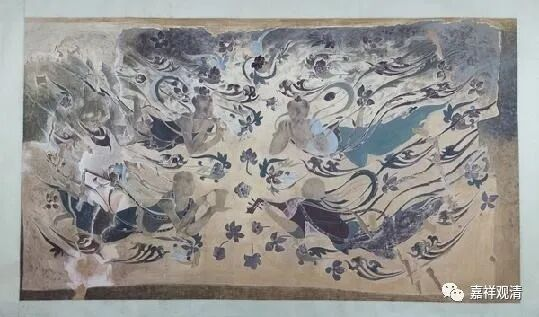

**《微课中观史》33·2**

这个情况怎么说呢？中国历史上的四大译经师当中，三位是唯识系统的，中观派的大译师只有这一位。所以汉文当中唯识系的经典保存得比较完善，也比较多，而中观系的经典基本上就只依靠鸠摩罗什法师这一位了。

当然，后来唐宋时期，也有人零星地翻译了一些中观派的著作，玄奘法师也翻译过清辨的《掌珍论》，但是这些基本上都不怎么流行。我们稍微数一下……

唐以前除罗什大师外，还有般若留支翻译了无著菩萨的《顺中论》，此虽署名无著，但和《显扬圣教论》的意趣全然不同，果然是“顺”《中论》的。菩提流支翻译了提婆的《百字论》，这是连《释》一起翻的。《释》也很简单，文字很难嚼。内学院吕澄先生有一个讲义，应该是目前汉文里唯一的一个《百字论》的释文了。按吕先生的抉择，《百字论》的思路相当精彩！

唐朝的时候，玄奘法师翻译了清辨的《掌珍论》，翻译这本的意图，是给弟子们当作学因明的教材；还翻译了提婆（圣天）的《广百论》，这就是圣天《四百论》的后半部分，因为玄奘法师翻译了护法的《广百论释》，所以就把这本也单独辑出来了。《四百论》的全本，现在有法尊法师译出来了，后一半（即《广百论》）在奘师的基础上略做了改译。《四百论》的注解，后来由任老译出了贾曹杰大师的《释》。

唐中期的波頗蜜多羅翻译了清辨的《般若灯论》，他也是那烂陀寺唯识系的译师，所以把此论中和唯识论战的部分删略了。据说圈里某法师很赞《般若灯论》，我们鼓动他翻吧。《般若灯论》就是清辨的《中论释》。

另一部安慧的《中论释》在宋初译出来了，现在《大正藏》和《卐续藏经》里各有一半，现在有影印的单行本了。安慧是印度唯识大家，大宗师级的人物。

宋代施护大师翻译了不少中观系的作品，龙树的《大乘二十颂》、《六十如理论》、《大乘破有论》都是他翻译的。他还翻译了寂天的《入菩萨行论》和《集经论》，但署名龙树。《入菩萨行论》，施护译为《菩提行经》。

宋以后到清代，汉地的成建制的汉译经典工作已经结束，我看这个工作——以国家译场来组织大规模的翻译，要到新中国了，经典的就要算商务印书馆的《汉译世界学术名著丛书》，当年参加这个翻译工程的都是学术大牛，比如贺麟先生。这是题外话了。

中观著作再次成建制的译讲，罗什之后，就是现在了。我们生在一个好的时代啊！

上个千年的尾巴尖尖上，我在某佛学院教中观。有一次上课之前，先去了趟国学书店，赫然看到《龙树六论》，我当时眼泪就要下来了，快哭了，一下子买了六本，带去佛学院，然后推荐佛学院的学生也赶紧买，因为《龙树六论》第一版的印数才三千，后来反复加印，还有盗版的，呵呵，我都有……看来我对中观还是有感情的（这份感情，能挣个净土的签证不？）。

现在中观系的书译出很多了，很多教材也翻译过来了，过几年这些译本会“井喷”吧。

