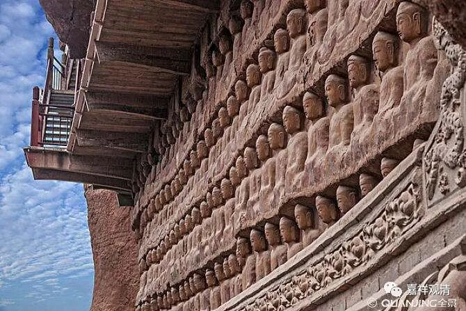

**《善说精髓》084（109）**

** “此等之上细空者：如显现无粗法等，**

** 亦违实有由思成。”**

** “此等”**如幻喻** “之上”**的微** “细”“空”**理为何** “者”：“如”**其** “显现**”而“** 无”**彼** “粗法”**等，这种道理** “亦”**是** “违”**背** “实有”**的成立方式的，这个道理，经** “由”**我们** “思”**考可以** “成”**立。（顺这段话真不容易，累死我了。）

上面说了（银幕上的）电影不是真事、梦中的事情也非实有、镜子里的不是我的脸，这是粗的空，世间人容易理解；那，影像等上的微细比喻的空理是什么呢？

应知，若是实有、自性有、由事物自己这边成立selfbeing，则必须是“如其显现而有”，他是怎么存在，就怎么显现；是怎么显现，就怎么存在。那么，谛实无、自性无就是，“如显现而无”，事物的本质不是他呈现出来的样子——呈现为战争而实际是光影，呈现为山河而实际是梦境。呈现为脸而实际是镜面反射的成像……这种“非如显现而有”的“梦”“幻”“影像”，和我们说的“自性无”的“非如显现而有”是一致的，这个我们通过再再的思维就可以认识到。

前面我们说，此处的如幻，主要是说的圣者后得位的“如幻”、世俗谛的如幻。这时的情况是，在后得位观察诸法的时候，诸法是现似有自性、现似谛实存在的，但通过正理去思择的时候，则能通达其无自性、非谛实这种“如其显现”的“无”，就是这里的如幻。这种“如所显现而无”的“如幻”，要比粗分的“镜子里的不是脸”要来得更微细些，

** “达称妄喻无性后，亦了诸法称无妄，**

** 解喻义理次第定。”**

在通** “达”**了世所传** “称”**的虚** “妄”**的比** “喻”“无”**自** “性”**之** “后”**，** “亦”**能够明** “了”“诸法”**的无自性，后者是世所传** “称”**为** “无妄”**的。这里，了** “解”**妄** “喻”**和通达无自性的** “义理”**的** “次第”**是决** “定”**的——即，先明白妄喻，再明白无自性的义理。

先了解大家都承认的虚妄法无自性，再通过它，了解大家先前所不认可的“非虚妄的法”无自性，这就是教学、认知的次序了。

（这段文字顺下来真是累坏我了。《略论》的文字还通顺些。所以义理方面的表达，长行肯定比颂文有优势。）

