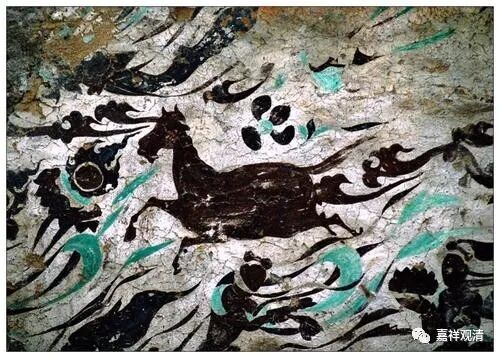

**《微课中观史》33·4**

我们前面还提到过，鸠摩罗什法师也翻译过很多禅学——这个“禅”就是我们通常讲的打坐，不是后来讲的“中华禅”的那个“机锋禅”。他翻译的是印度的静虑——这个禅学的典籍。还有《十诵律》，也是鸠摩罗什法师翻译的。

对于我们研究历史比较重要的一点是，鸠摩罗什法师的那个时代，相对来说离龙树菩萨、提婆菩萨的时代比较近。他的老师是两位莎车王子，这两位的老师的师承系统好像是指向青目论师的，青目论师再往上传说就是罗睺罗跋陀罗，罗睺罗跋陀罗再往上就是提婆论师。当然，这中间有虚线的成分，虚线的成分就是从青目论师到莎车王子之间有没有隔着什么人，这没有记载，可能没有，也可能有，一般就当没有……反正时代并不远。所以鸠摩罗什法师翻译的《龙树菩萨传》、《提婆菩萨传》和《马鸣菩萨传》，就具有较高的文献价值，可以说是离龙树菩萨、提婆菩萨的时代最近的传记了。这个传记到底是翻译的还是撰写的，就很难说了，但至少是从鸠摩罗什法师手里出来的。

那么，鸠摩罗什法师到了长安以后呢，和庐山的慧远大师也有书信来往，后来从他和慧远大师的通信当中被整理出来的一部作品，也不算是专门写的，叫《大乘大义章》。当时慧远法师提出了很多问题，例如当时比较流行的关于佛的法身的问题等等，正好之前中国在讨论神灭和神不灭，致敬王者还是不致敬王者这些问题。

于是，慧远法师就提问了鸠摩罗什法师，主要是问了一些类似于佛的境界方面的问题吧，还有一些关于阿毗达磨方面的问题，包括上次我们提到的关于眼根、耳根等等，鸠摩罗什法师就是在这些回答中提到的，眼根就像针尖儿一样，这是鸠摩罗什法师在《大乘大义章》中对慧远法师的回答。

鸠摩罗什法师还在新疆的时候就听说慧远大师的名字，名气很响，两个人可以说是惺惺相惜。当时鸠摩罗什法师甚至有讲过这样的话——这种话可能大师们相互之间都会经常说：“有您这样的人在中国，我就不用过来了。”（这个说法好像很耳熟哦。）

在慧远法师提出这些问题以后，也在看到了慧远法师更多的著作以后，鸠摩罗什法师还是发现了很多问题。虽然慧远法师比起在他之前的那些大师应该说已经水准很高了，但是他是属于一个纯“中国”的人，是以中国人的思维去理解佛经的，还存在很多先天的不足。而鸠摩罗什法师先天是印度人，又专门去了克什米尔在梵文的背景下学习了这么多年，两者的差别还是挺大的。

鸠摩罗什法师在中国待的时间比较长，结果就教出来一大批弟子，而这一大批弟子在他身边的时间比较长，所以他们学的是比较完整的一个学派。我们也可以说，以一个比较完整的学派形式把佛教传到中国来的，鸠摩罗什法师可能算是第一个。在鸠摩罗什法师这种大型的几百上千人的教学过程中，有比较重要的一些人被称为“四圣、八俊、十哲”，其中最重要的呢，有这样三个人——僧睿法师、僧肇法师、道生法师。

鸠摩罗什法师所翻译的主要经典，几乎都是由僧睿法师来写序的，都是很重要的序文，相当于我们现在说的导言或者前言。这些序的文字也非常优美，把握要点也非常好。僧睿法师在鸠摩罗什法师门下学习的时候年纪比较大了，他本来就已经是一个高僧或者名僧了，从这些序文来看呢，他的佛学水平和语言能力是相当高的。这是鸠摩罗什法师门下的一个著名人物。

另外两位著名人物就是僧肇法师和道生法师。其他的法师也很多，但是最著名的法师就是这三位——僧睿法师、僧肇法师和道生法师。

今天时间差不多了，我们就先讲到这里，谢谢大家。

