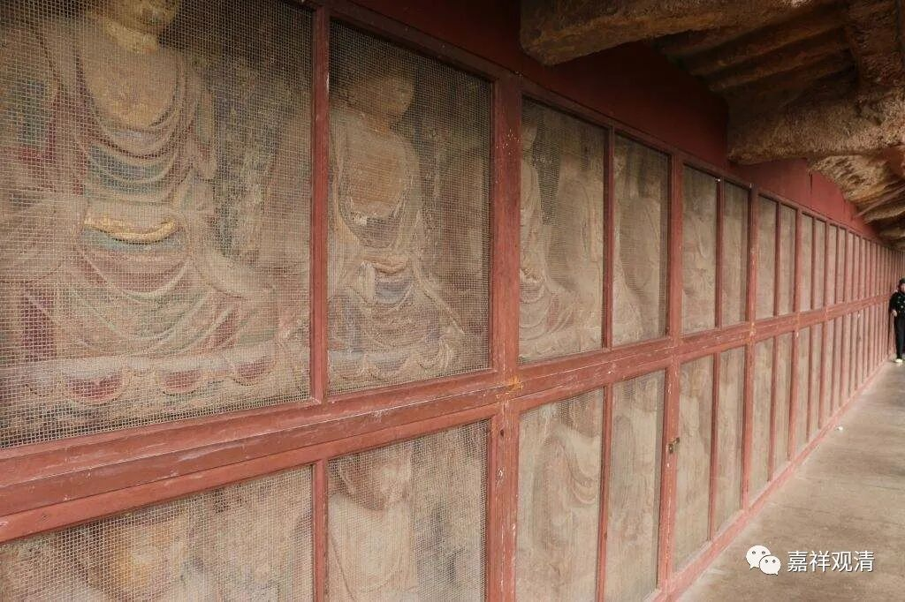

**《善说精髓》084（110）**

** “论云‘说一法见者，即一切见者’之义，**

** 意为解时心进观，即能通达其密意，**

** 似指现前惟同证。**”

对方继续问难，说：提婆论师（圣天）在《四百“** 论**”》中有“** 云**”：“** 说一法见者，即一切见者；**以一法空性，即一切空性。”如此，则通达一法体性空的同时，就通达了一切法体性空？因为“一法空性，即一切空性”啊！

自宗说：不然！《四百论》说：“说一法见者，即一切见者；以一法空性，即一切空性”，这一句“** 之**”真实“** 义**”理，“** 意为**”——以通达、了“** 解**”一法的自性空的“** 时**”的“** 心**”，“** 进**”而“** 观**”察其余诸法，“** 即能**”观察到，随一法上（“随便哪一个法”，也就是“一切法”了。比如说“这本书随便拿一页我都能背”，也就等于“这本书我都能背”了；“报身佛净土随便一个听众都是地上菩萨”，等于说“报身佛净土的听众全都是地上菩萨”）都如前能“** 通达”**、了知“** 其**”自性空寂——此即《四百论》此句的“** 密意**”。

宗大师在引此句“** 说一法见者，即一切见者**”作解释的时候，说：“通达一法空性之见者，即能通达一切法之空性”，意思是，以前述“一法”无自性之理，“能够”通达余者无自性——这里的关键，在一个“能”字，而不解释为通达一法无自性的同时通达一切法之空性。

本论在这里多给了一个解释——“** 似指现前惟同证**”，“** 似**”乎是“** 指**”如果从“** 现前**”知的角度来说的话，“惟”其现证一法的空性，也可以“** 同**”时现“** 证**”余法的空性。这个说法我不是很理解。我还是依宗大师的解释吧。

一法的空性和余法的空性，道理是一样的，但，色的空，所依是色；受的空，所依是受，所以，不能够如言取义地直接说“一法空性即一切空性”，要加以解释。前面说了，颂文的形式，一般来说不如长行表达精确，他有一定韵律、格式限制。所以，从这个角度出发，《瑜伽师地论》说，十二部经中的讽诵经，属于不了义经，因为需要加以解释。

