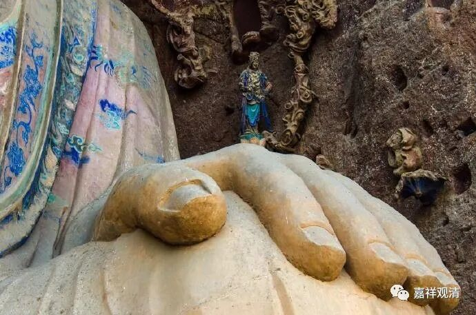

**《微课堂佛教史》034·1**

我们继续佛教史，现在已经讲到中国的中观派系统。

中国的中观派系统是从鸠摩罗什法师开始往后，流传了一段时间，我们就讲一讲鸠摩罗什法师往后的历史。鸠摩罗什法师的故事大家已经听过很多了，微信推送也已经发过好几篇，我忘了有没有给过年谱，大家有兴趣的话，还可以看一看。

鸠摩罗什法师在当年是一个外国人，“不远万里来到中国”，是被劫持而来的，然后他学习了汉语，进行了大量的佛经和论典的翻译以及讲学的工作。在此期间，他教导了大量的弟子，其中最出色的有“四圣、八俊、十哲”，具体的名字我有点忘了，反正差不多就是最顶尖的四个四个，高手八个，也有摆出十个的。后面八个十个的，大家数的不全都一样。

那么，最重要最著名的弟子，我们昨天讲有三个——僧睿法师、僧肇法师和道生法师，再加第四个——道融法师。僧睿法师是这些弟子当中年纪比较大的一个。僧肇法师的年纪非常轻。道生法师年纪也非常轻，是吧？还有一位道融法师，没有什么特别的传记留下来。这几位都是当时的豪杰啊！

最有名的还是僧睿法师、僧肇法师和道生法师这三位。想想那个时代——魏晋南北朝的时代，当时的佛教我们现在说起来是非常的提气，那些都是一时的人杰啊！反观我们现在，想要讲讲什么都很不容易聊，聊什么都聊不出来。而那个时代，你看看这些人，都是年少成名，或者年少就已经学得非常好了。南北朝时期，那是一个英雄的时代！

僧睿法师二十几岁的时候就已经学得非常好了，在江湖上已经很有地位了。他也是道安法师的弟子——“弥天释道安”的弟子，或者说和道安法师一起在襄阳待过。

僧肇法师好像二十三、四岁的时候就写了《般若无知论》，还让当时的江湖大佬慧远法师和庐山僧团刮目相看：“这个不得了啊！”刘遗民居士赞叹说:“不意方袍复有平叔。”意思就是，没想到在出家人当中也有能和魏晋玄学开风气的人物平起平坐的泰斗。平叔，曹魏的何晏，是非常魏晋玄学泰斗级的人物，执牛耳者，当时能和他齐名的只有王弼了吧。大家没想到佛教里面还有这样的人物，那个时候僧肇法师才二十三、四岁。

道生法师也是一样，年纪轻轻就已经名震江湖。他在《涅槃经》的大部经典还没来之前，就依照之前单独翻译出来的前面几卷的内容，推出后面可能的说法——这个太了不起了！因此在当时被称为“涅槃圣”，说是经典还没过来，他就按照前面的六卷，推出后面四十卷当中最重要的内容，这个太了不起了，当时称为“孤明先发”，经还没来，意思就凭着前面几卷，自己推出来了。这就像一个绝世的武林高手，凭着手头的前几页刀法残卷，愣是自己悟出了整部秘籍！这个太牛了！

