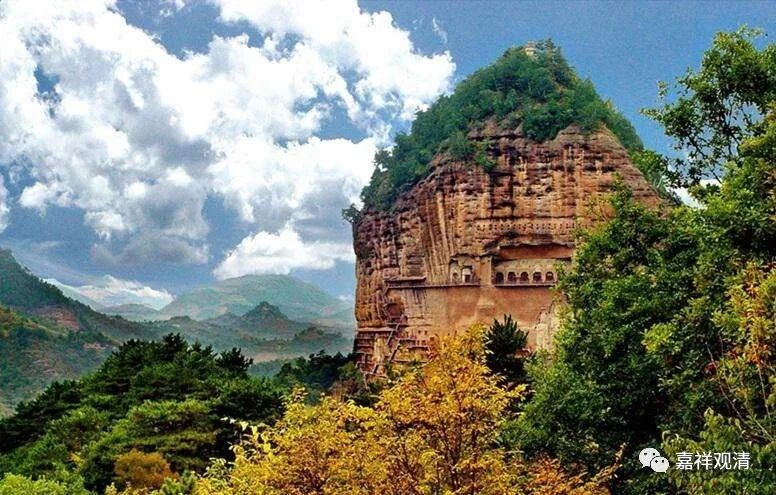

**《微课中观史》34·2**

僧肇、道生，出成果的时候都很年轻，所以一谈到那个时代的佛教实力，让人感到非常的提气，那个时代一流的知识份子都在学佛。而我们现在就很丢人，是吧？我们现在是不好意思说，现在出家人要熬出头的话，基本上都是要靠熬资历，等胡子白了，可能胡子白了不行，必须要腰都弯了……这是拼谁活得长、拼资历，那个时代可是拼谁年轻、拼实力、拼聪明程度啊。

后来三论宗的吉藏大师也是，二十五岁就升座代师讲课了，那时的出名就像现在的围棋界。以前围棋界说，“没有三十岁以前的冠军”，现在二十岁之前拿世界冠军多的是。我们现在的佛教界却恰好相反，我们这个时代没有一等一的人才，只有像我这样庸庸碌碌的人来凑数。

我们继续讲鸠摩罗什法师的弟子。僧睿法师在这三个最著名的弟子当中是年纪最大的。这些法师都有一个背景，都是先识字的。“识字”，可能在我们现在看起来这没什么，但在当时还真算是一个条件。他首先得是一个知识分子，是不是一个世家子弟，那就不一定了——前一段时间我们讲过“种姓”的问题。

那时候如果一个僧人是世家子弟、士族、门阀家族出家的，说明他“先天”的基础不错、眼界也高、人脉也有，在出家人当中已经先挤进前百分之五了，如果之前学问有根柢，跟着高僧（比如道安法师、鸠摩罗什大师）就很容易出成绩。

假如不是世家子弟，是寒门出身的话，学佛、出家在那个时候真的有这样的作用——他可以打破当时的种姓制度或者世家、门阀制度，打通另一个上升通道。只要有学问，不怕你出身寒门，你也能够出人头地，也能够做“方袍平叔”、收到士大夫上层的尊敬。也正是出于这个原因，或者说至少有出于这样的一些原因、计算到一部分这样的原因，一些寒门子弟就因此出家，除了打仗之外（其实打仗也不见得能够被提拔），在科举制度以前，这是一个冲出自己阶层的捷径。很多寒门子弟出家以后，由于本身的努力，学问、修养都很高，在佛教界进行学术研究和学习禅修后都很有建树，所以就吸引了更多的人出家，形成一个良性的上升通道。就这样，佛教在这个时代得以人才辈出……

所以我们现在就讲刚需——学佛能不能成为刚需？这两天正好谈到了这个话题，可以说在当时（南北朝时期）的中国知识界，学佛也是一种“刚需”。今天在中国，学佛早已经不是刚需了，甚至是弃子。如果你在西方的话，宗教都是刚需。

那么在佛教里面，民间佛教、祭祀的佛教则是刚需，解脱的佛教、文化的佛教，那绝对是苟延残喘，“苟全性命于乱世，不求闻达于诸侯”——能有个喘气的机会就“阿弥陀佛”了！现在的“诸侯”就是大老板……

我只是这两天正好和人谈到这个话题，所以就和大家聊一聊。我们可以看到，在南北朝时期的很多高僧都是世家子弟，一直延续到隋唐的时候，包括玄奘法师的父亲也是当官的，一行大师是张公谨的孙子，基大师是尉迟恭的侄子……都是士族的、世家的。还有智者大师也是世家子弟，三论系统的慧布也出自上层军官阶层……这样的例子，那个时代前后，可以举一堆。

