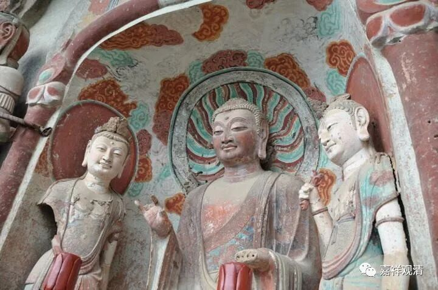

**《善说精髓》084（113）**

“** 不修了解所破要，全无作意修长久，**

** 后得现相如烟虹，柔薄于彼觉无惧，**

** 但遮粗碍之修为。**”

“不”去“修”持应当“了解”、掌握的“所破”的关“要”，仅仅靠“全无作意”、摒弃自心造作地静“修”经时“长久”。“后”时虽然可以获“得”“现相”“如烟”、如“虹”、“柔薄”的景象，“于彼”等尚“觉”其为“无惧”。这样的境况，其实质仅是“但”但“遮”除了“粗”分质“碍”（色）“之修为”罢了。

有的人，并不学习正理与所破的关键，光在那里坐着“不执著”、“随它去”而长时地熏修，以为这种“态度”就是修空的方法。这样的“修法”，虽然在他出定以后（这里的“后得”，并不是说他真的得到圣根本无分别定的后得位，仅仅是说他在出定以后）会有外境不实如虹霓、如烟等的感觉，但这仅仅是对粗分色法的遮遣而已，和修空没什么关联，最多也就是获得些禅定的果位罢了。

有些大法师，数千人的讲堂里开演佛教的空理，用手在空中挥舞，问大家：“懂了吗？”我看得一头雾水——玩机锋？（他要是不再解释，我也不知道他深浅，但他没憋住……）法师继续说：“这就是空，手在空中才能挥舞，而空是不动的，能动的都是幻像……”这有点像周伯通的空见，老顽童的七十二路空明拳：空碗盛饭、空屋住人……这种空叫“色于中行”的“虚空”，跟真如空性的“空”是两个“空”啦，类似今天物理学里的“空间”或者“真空”的概念而已——民国时期有人拿这种空来附会西方当时的“以太”（真空）。老法师可能受到年轻时听课的影响吧。老法师水平还是不错的，但是在空理上可能还有待继续学习……

“** 自性成就全非有，能立无过因果二，**

** 以彼量成获深道。**”

接着总结正确的二谛建立：一方面“自性无”——“** 自性成就全非有**”；同时还“** 能**”成“** 立”“无过**”的“** 因果**”，这“** 二**”者能够互相成立、互相扶助，这样的心能够正确地生起，“** 以彼量成**”，便认可是“** 获**”得了甚“** 深**”的中观“** 道**”。

虽然在“** 显现如幻之理似义**”的科判下，但这几句是正理的总结，并不是所要批判的对象。

