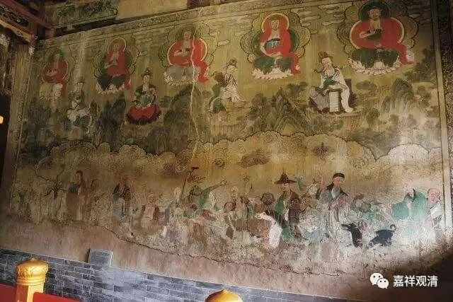

**《微课中观史》34·4**

后来鸠摩罗什法师的汉语更好了呢，僧睿法师就作为上首弟子参与了译经，还参与了讲习——就是他听课，同时也开讲。这个和我们现在不太一样的。说起来羡慕啊，以前大量的人才在僧界里边，现在大量的人才在金融、工商，在最赚钱的那些地方……

鸠摩罗什法师在翻译这些经典的时候，是按照以前的习惯把这些经典专门拿出去给人抄写的，因为那个时候印刷术还没冒头。给大家抄写的时候，前面一般也会做广告或者提纲挈领，就像《四库全书》有一个总目提要这种性质的。那时候的名称不叫“提要”，叫“序”。某一部经典翻译出来的时候，比如《中论》、《大涅槃经》、《大智度论》翻译出来的时候都要请大师写一个“序”，相当于现在的序言、导论。僧睿法师给这些经典的译作写了大量的序言和导论，也说明他本身对这些经典掌握得非常好，也是当时的僧中人杰，所以才推举他作序。说起来，那个时候作《序》的人也不止一家，但历史留下了僧睿法师的《序》，历史老人的选择，偶然性当中有必然性……

鸠摩罗什法师在翻译了《成实论》以后就说：“我翻译《成实论》的原因是什么呢？《成实论》差不多是介于小乘的有部和大乘的中观之间，在这部论典里面大概有七处是破毗昙——有部的，你们能不能把这些找出来，或者你们能不能讲解，那我就不需要讲解了。”

然后僧睿法师就按照刚刚翻译出来的《成实论》进行讲解，可以说是把这几个地方都找出来了——我记得好像是七处，有七个地方是专门破有部的。其实我们现在来看，应该是绝对不止七处的，有很多很多地方了，不过当时有“七处”这个说法（其实是《成实论》在涉及到宗义对比的那部分，有“七处”和有部有差异）。这也说明了僧睿法师的基本功很扎实，对有部的内容也掌握得很到位，对鸠摩罗什法师所翻译的经典也把握得很精准。

僧睿法师另外还有一个很有名的故事是关于他的文字能力的。在翻译《法华经》某一段的时候，鸠摩罗什法师认为这一段可以翻译成“人见天，天见人”，释迦牟尼佛加持一下，人就可以看到天神——一般是做不到的，天神也可以看到人。但是鸠摩罗什法师又认为，这样的翻译文不雅驯。僧睿法师马上就说:“何不翻译为‘天人交接，两得相见’呢？”鸠摩罗什法师当时就一拍大腿——不知道究竟有没有拍，或者拍的是自己的大腿还是别人的，不知道。反正鸠摩罗什大师就说这个翻译很赞，文字雅驯，非常地漂亮，意思也到了——天见人，人见天。所以你们如果念《法华经》的话，会读到“天人交接，两得相见”，就是僧睿法师的文字（我几乎每次念到这里都会开个小差）。当然，其实类似的文字很多了，这只是一个经典例子。

今天先讲到这里，谢谢大家。

