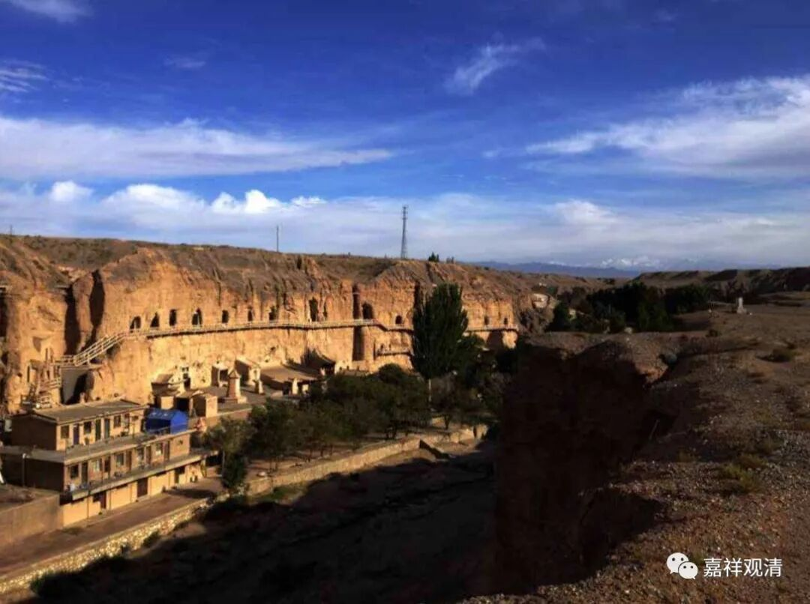

**《善说精髓》084（114）**

** “亥二、依何方便显现如幻之理”**

** **

上述“如幻”的正理是通过什么方式显现的呢？

** **

** “是故先于凈定中，破实执境如虚空，**

** 修习空性若达要，次出定时观诸境，**

** 后得如幻自然现。”**

** **

** “是故”**，就是基于前面的“自性成就全非有，能立无过因果二，以彼量成获深道”这一句，获得甚深的中观道后，起“** 先**”。“** 于**”清“** 净**”的圣根本无分别“** 定**”中，“** 破**”除了“** 实执**”所执“** 境**”（这就是《三主要道》里说的“即灭实执所执境，尔时见观察圆满”）；此时，即是“** 如虚空**”般的，“** 修习空性**”；“** 若**”于此处“** 达**”其关“** 要**”，复“** 次**”于“** 出定时”“观诸境**”像，其“** 后得**”位“** 如幻**”化的情况是不需励力地“** 自然”“现**”前。

** **

这是说，在圣者的根本定中彻见诸法的“自性”本无，则在其出定的后得位，自然显现事物如幻化地存在。其未证圣位而修习此法者，在出定的时候也能够在正理的熏修下对世间的诸法觉察到与未达空理时有所不同……

这里的如虚空，又是一个比喻。前面说，虚空是“色于中行”，单纯就是“没有色的”，是一个“无遮”。这里证得的空性也和这个很像，是一个“无遮”——单纯否定一个自性。

“无遮”和“非遮”又是一堆概念，据称最早是由清辨大师分析、提出的，很有道理。无遮，就是在一个“否定”的背后，不再引出什么；“非遮”，就是在一个否定背后还要引出一个小尾巴。举一个例子，“房间里的不是兔子”，就是非遮；“房间里没有兔子”，就是无遮——前面虽然有否定，但还带出了“不是兔子，是其他的”；后面就单纯否定了“房间里的兔子”，不讨论其他。

在这里，自宗的意思是：证空的时候，如“虚空”一样的是一个无遮——“寻找自性，了不可得”！在那个时候，不需要成立什么，因为一旦成立，不论是什么方式的成立，在这时候就变成成立自性了。成立是要等后得位、旁观的时候来成立的。唯识里面说的“安立谛”、“非安立谛”也是类似的意思（不完全一样，类似）。

