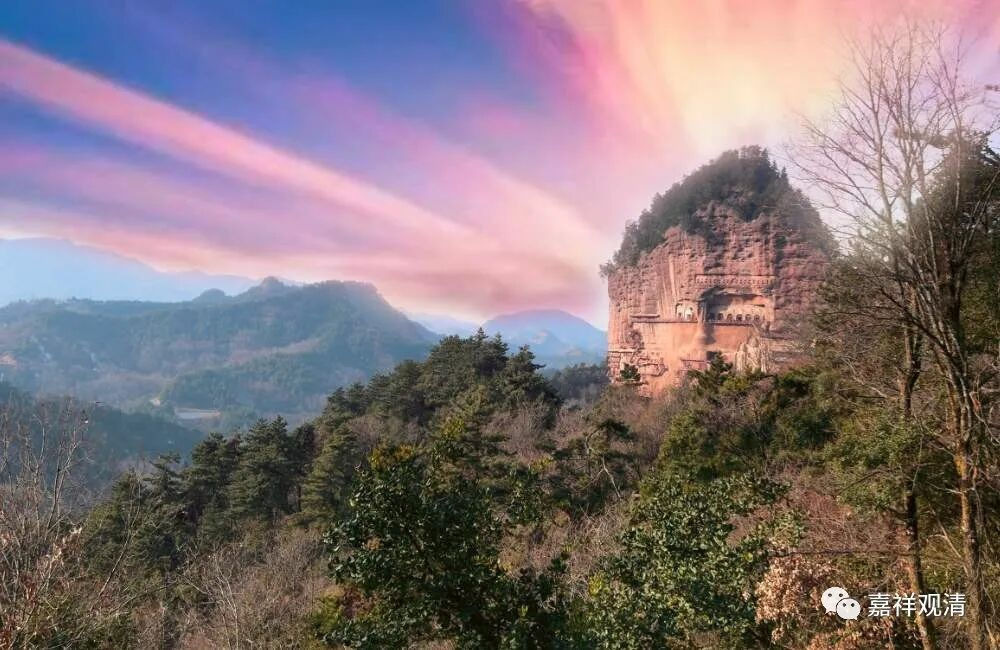

《**微课堂佛教史》035·1**

我们继续佛教史，看看讲了讲佛教史之后，喉咙会不会好一点？有可能哦。这两天发病，好像都是因为没讲课。

我们讲到鸠摩罗什法师的弟子，他的弟子当中最出色的应该是道生法师，后面会讲到，但可能今天讲不到，反正我们先讲着吧。在鸠摩罗什法师的弟子当中，最有名的被称为“四圣、八俊、十哲”，其中年纪最大的、威望最高的是僧睿法师。他在当时是非常有名的，曾经参与一场翻译，有一些非常有名的段落，比如“人见天，天见人”后来被翻译为“天人交接，两得相见”，就是僧睿法师所润色翻译的。

另外还有一件比较出名的事情，给大家加强记忆一下。翻译《成实论》的时候，鸠摩罗什法师没打算讲解，他说：“翻译这部论呢，主要是因为他基于大乘（实际上他要讲的是中观派）的空观和小乘（实际上是有部）之间。《成实论》里面有七个地方是批判有部的。”然后，僧睿法师就直接把这七个地方都讲出来了，这也说明他对《成实论》把握得非常好。

僧睿法师是鸠摩罗什法师弟子当中最有名的一位，那么第二位是谁呢？前一段时间看何欢欢教授现在写的一篇文章——《中国历史上排名第二的高僧究竟叫什么名字？》，说的是窥基法师，内部的说法是称“基大师”或“大乘基法师”，“窥基”这个名字是宋以后的讹传。那么，排名第一的高僧是谁呢？玄奘法师吗？按传统中国人的说法，排名第一的可能是僧肇法师。中国佛教近千年来对玄奘是没什么太大概念的，还算是民国以后才稍微抬抬头。

这里面有另外的原因。玄奘法师的翻译水平、佛学素养固然是非常出色的，是一个加分项，但是，近千年来，唯识在中国佛教界基本被定性为“大乘初阶”，被称为法相宗，认真专研的人（有吗？）被斥为“执相而求”的“知解宗徒”。中国佛教界在中国佛教史里面最推崇的中国人自己的著作，是《肇论》。藏经编排目录的时候，本土著述，《肇论》历来独占榜首，从未动摇。中国人用中文写作最出色的佛教作品，都认为是《肇论》。第一，这部论著是中国佛教史上比较早期的作品；第二呢，他的文字也非常《庄子》，中国的知识分子很爱读——虽然基本都读不通。（其实我也是这样，读起来很庄周，但意思全靠猜……）

在汉文大藏经本土撰述当中，《肇论》是排在第一位的。当然，也有一个原因是因为僧肇法师的时代比较早，一般** 心情好的时候**会把他称为第一僧——中国最厉害的。这个“第一”和“最”是两方面的：一方面是他的学问也很高，另一方面是他的那个时代比较早。比他时代更早的当然也有，但是本土的僧人达到他这个高度的又没有。

刚才我说“心情好的时候他是第一僧”，呵呵，这里有个典故……

藏传佛教格鲁系统以辩经的方式学习，在学《现观庄严论》之初有一个题目是“弥勒是佛还是菩萨”。某顶尖寺院听说蒙古亲王府派来供僧的管家曾在另一个顶级寺院浸淫过二三十年，遂极力邀请他上辩论场，这也是一个法会时表演性质的一个仪式，管家推辞再三不得。辩经的时候，对方就抛出了这个问题——弥勒是佛还是菩萨？管家很机智地回答：“在我们寺院，和尚们心情好的时候弥勒就是佛；心情不好的时候，他就是菩萨！”很幽默地把问题挡了回去。后来亲王府又把管家送回寺院，成为寺院的顶梁柱，转世系统被称为“AM班智达”。

呵呵，所以，我们心情好的时候，僧肇大师就是第一僧；心情不好的时候，“我是第二，第一空缺！”

