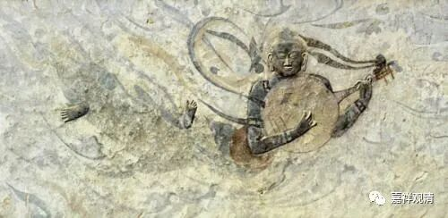

**《微课中观史》35·2**

僧肇法师的年龄呢，按照一般的传记上说是三十一岁，但是现在有些地方说他是四十一岁去世的——这个好像是汤用彤先生说的，是因为什么呢？他觉得三十一岁实在是太年轻了，应该写不了那么多东西，和鸠摩罗什的年代也有点对不上。不过，其实这个也很难讲的，应该说是我们把他往四十一岁上靠，就是觉得心境上不应该是三十一岁。所以有人就说是四十一岁，因为以前二十、三十都有专门的写法，卅就是三十，也有一种四十的写法——卌，就是一横上面画四道的，就说僧肇法师的年龄应该是四十一，可能是抄写错了。大家知道有三十一岁和四十一岁这样的说法。

若问我僧肇法师的寿量是多少。以前我还是比较传统地接受三十一岁之说，认为汤先生解释为四十一岁之说多少有点牵强。那时候还是年纪轻啊，见识浅薄。最近我收集了一些碑刻资料、读了几卷敦煌写经，才知道汤先生说的应该是事实真相了。类似“廿”“卅”的，四十确实有写为四竖一横的“卌”（念xi），而且当时很常见，后来把“卌”抄成“卅”的，《僧肇传》也不是孤例。（洪迈《廿卅卌字》：“今人书二十字为廿，三十字为卅，四十为卌，皆《说文》本字也。”）有些东西，没见过实物总是隔着一层，见到了“卌”字的实物，就“顿悟”了。

僧肇法师在小时候是给人家抄书的，叫抄书为业。印刷术在那个时候可能根本就没有，那时候书的流通主要是靠抄写的。那个时代呢，就流行一些玄学的著作，他就抄书，抄了以后呢，心里面就慢慢地有一点把握，能够认识一点了，之后就继续学习。过了一段时间，他对道家的老庄就非常感兴趣，但是总觉得言之未尽，没讲到最后，后来一看到《般若经》，就觉得：“大乘教义尽在斯矣。”差不多是这个意思，然后就皈命我佛，信佛了，出家了。

正好在他年轻的时候，法门的龙象——鸠摩罗什法师来到了长安。僧肇法师就“不远万里”（大概没那么远）、千辛万苦（这是实话，南北朝时期是江湖大乱斗……）来到了长安，跟随鸠摩罗什法师学习。他学得非常好，没多久就开始动笔，他也喜欢动笔，毕竟年纪又轻。大家别忘了他的学习动机很好，文字功底也扎实，所以他写的“论文”鸠摩罗什法师也相当满意……

当时鸠摩罗什法师就对他说过一句话：“吾解不谢汝，辞当相揖。”是什么意思呢？“吾解不谢汝”，就是我的理解肯定不会低于你。谢，就是谢谢的谢，辞谢的谢。我的理解——我对中观的认识，肯定是超过你的。“辞当相揖”是什么意思呢？我的文笔不如你！就是说你的文字实在太好了，对于介绍中观有相当大的帮助。

