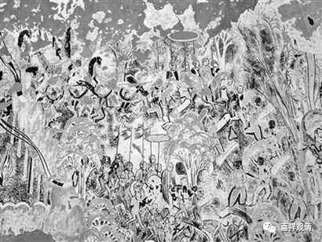

**《善说精髓》084（117）**

** “同喻像，虽空然依形镜生，”**

** **

这里的** “同喻”**呢，就比如镜子里的镜** “像”**，镜像** “虽”**然不是实有的物质，因此可说** “空”**，** “然”**而镜像** “依”**自己的身** “形”**和** “镜”**子而得以** “生”**起，所以也不是毕竟无。

** **

** “如是人虽无自性，依惑业生亦可立，**

** 受果者理数忆念。”**

“** 如是**”，何此相似地，“** 补特伽罗虽无自性”**，然而依“惑”（即烦恼）、“业”、“生”亦可成立有受果者……这里的道理应当数数忆念。

“惑”、“业”、“生”，有些地方译为“烦恼”、“业”、“苦”，阿毗达摩里面，这三个还被称为“三杂染”。“三杂染”打开就是“十二缘起”：“无明”和“爱”、“取”三是“惑”；“行”和“有”二是业；“识”、“名色”、“六入”、“触”、“受”、“生”、“老死”这七个是“生”。龙树菩萨的《缘起心要颂》说：

“** 初八九烦恼，二及十是业，于七皆是苦，此有轮数转。**”

由惑造业，因业而生，依生、苦而造烦恼……这就是“有轮”，三“有”之“轮”，这就是轮回、流转啊！流转生死的补特伽罗虽无自性，而依三杂染、十二缘起可安立为有。

我们因为“无始以来”的习惯、熏习而不由分说地认为“补特伽罗”（简单说就是“我”啦）就是这样客观而独立存在的，并通过不同的方式来证明“我在”。通过上述推理，补特伽罗自性成立、独立实有这些被遣尽无余；而在世俗名言量的观察下，观待而安立的补特伽罗是可以立住的。观待前世的惑业有今世的苦（生），观待今世的生死而有来世的流转……这“观待”的就不是“自性”的，“自性即无作、无待”，“缘起即有待、有作”，在承认缘起、观待的背景下，自性的成立便自然地消解了。

就像我们在轮回中数数熏习而坚固地执诸法为自性存在，对“缘起无自性”的道理我们也应该数数思维，再再键入，最终获得定解，单单一两次思维是不够力量的；若能够在禅定中思维观察，则更能帮助牢固建立空正见，就像钢琴大师演奏一旦“入神地忘我”、“忘我地入神”，则一定成就一段最美的乐曲！

