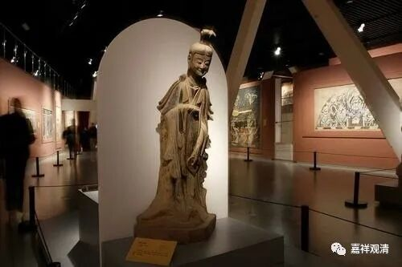

**《善说精髓》084（118）**

** “申二、抉择法无我**

** 分二：酉一、即用前说之理加以变更而破，酉二、用前未说之余理破。**

** 酉一、即用前说之理加以变更而破”**

** **

补特伽罗无我讲完了，继续谈法无我。

抉择法无我的部分，既可以用前面提到的一异分别的方式来抉择其无自性，也可以用其他的方式。“前未说之余理”，这里介绍了缘起因。

** **

** “复次修习法无我，依前说理引定解。”**

** **

** “复次**”，在“** 修习法无我**”的部分，可以“** 依**”照之“** 前**”所“** 说**”的正“** 理**”来类推，便可以依此“** 引**”发法无我的“** 定解**”。

** **

龙树大师在《中观宝鬘论》中说：

** “士夫非地水，非火风非空，**

** 非识非一切，异此无士夫。**

** 如六界集故，士夫非真实，**

** 如是一一界，集故亦非真。”**

** **

前一颂是说补特伽罗在所依处“地、水、火、风、空、识”之“六界”上自性的一异不可得，后一颂是说同理，一一界（地、水、火、风、空、识）也是依地、水、火、风、空、识等而有，然非自性之一异。

《菩提道次第略论》说：

** **

** “蕴处界法，总分二类。诸有色者，必具东西等‘方分’，与‘有方分’之二。凡诸心法，必具前后等‘时分’，与‘有时分’之二。当观彼二若有自性，为一？为异？如前广破。此如经云：‘如汝知我想，如是观诸法。’”**

** **

这里的“经云”，指的是《三摩地王经》，即汉译的《月灯三昧经》。这部经，老曲他们做过一个句读版的单行本，估计市场上现在已经没有了。

** **

《略论》在这里说的“有支”和“支”，类似今天我们讲的“整体”和“部分”——“整体”不能独立于“部分”而有，“整体”也不是某一个“部分”或某几个“部分”，依各支分、部分而有某事物之整体的概念。

对属于色法的，有其空间的方位的前后上下等部分；对属于心法的，有其时间性的前后差别，所以都可以用“一异推求”来分析其自性的有无。对于“无为法”，《略论》没有说，《掌中解脱》则以虚空为例，但似乎那个不是大乘所说的“虚空”，仅是“色于中行”的虚空或者“空间”的虚空。其实无为法也可以从它所依处的角度来分析，方式和上面也一样。

