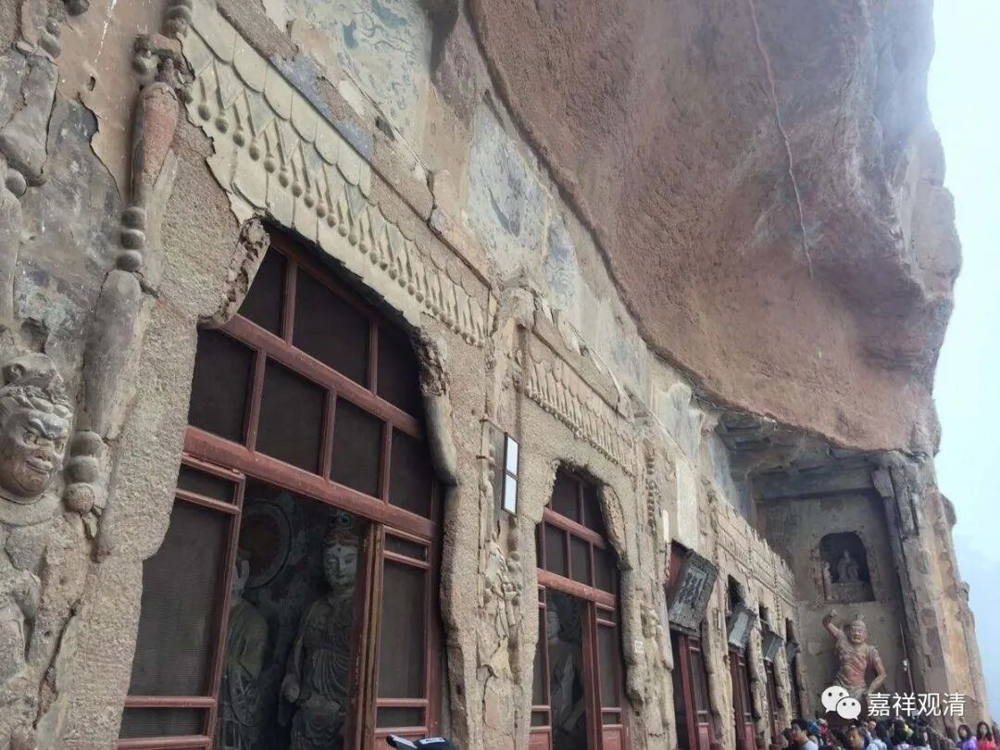

**《微课堂佛教史》036·1**

好，我们继续讲佛教史，现在正好讲到汉传佛教中观派的历史。

那么，汉传佛教中观派从鸠摩罗什法师传入，在他的弟子当中最出名的当属“四圣、十哲”，其中“四圣”就是僧肇法师、僧睿法师、道生法师和道融法师。“十哲”还有慧观法师等等。

我们昨天讲到了僧肇法师，他是个了不起的人物。在早期的僧传当中，说他多少岁就圆寂的呢？三十一岁就圆寂了！僧肇法师在中国的历史上非常有名还有一个原因。隋唐时代的中观这一系，或者说鸠摩罗什法师翻译的这些经典，对后来的禅宗产生了很大的影响。你们看看，禅宗后期的这些风骨，这些味道……大家可以看一部经典——《维摩诘经》，我们这个圈子对这些经典都不是很熟，你们有兴趣的话可以去看看。《维摩诘经》当中关于“不二法门”的这个章节中，维摩诘居士跟罗汉、菩萨的对答，和禅宗非常像，或者应该说禅宗的风格和《维摩诘经》非常像。禅宗对中观宗包括对僧肇法师都非常感兴趣，然后呢，就给僧肇法师编了故事。

为什么我会说编故事呢？因为这个故事实在是不太像，和真实的历史相违背。而且还有一个情况就是，晚期的禅宗公案当中，很多都不计较是否真实，更多地倾向于在讲故事。我们再对比中国的另外一本书《庄子》，它更多地倾向于在讲故事，至于这个故事背后是不是真的并不重要，所谓“理有固然，事未必然”，只要这个“故事”对你能够产生启发就可以了。禅宗公案的叙事风格很《庄子》，很多公案是《庄子》式的“寓言”而非历史的真实。

所以禅宗的《灯录》当中的这些故事，很多故事性很强，但不是真的。这就是王国维先生讲的，真和美好像不能够完全统一。

《景德传灯录》是在宋代时候出现的一部禅宗《灯录》，《灯录》的“灯”，就是师父给弟子一盏灯，然后再一盏盏的灯传下去，就是薪火相传的意思，有点像现在常说的传承一样。在《景德传灯录》当中就说，僧肇法师是被姚兴杀掉的，因为得罪了姚兴。姚兴说要杀他的时候，僧肇法师还很从容地说：“这样吧，你给我七天，我写一部论出来。”这就是后来的《宝藏论》——这不是宁玛派的《七宝藏论》，也不是《杂宝藏经》。

这个故事里面说僧肇法师还跟姚兴请了七天假，说要写一部《宝藏论》，写完以后就交出去，被杀的时候还写了一首偈子：“四大原无我，五蕴本来空；将头临白刃，犹似斩春风。”好像在故事当中，僧肇法师被杀以后，还流出了白血，意思是说僧肇法师是冤枉的。

这个故事从几个方面来看，都是编出来的。僧肇法师确实很年轻（三十一或者四十一）就死了，大家可能觉得他不应该这么年轻的很随便地就死了：是不是有什么特殊情况啊？于是就编了这个故事。

说起来，这首偈子倒确实是僧肇法师写的，但是这首偈子不是僧肇法师在写自己，他是在写谁呢？他颂的是《金刚经》里面忍辱仙人被歌利王割截身体的这段，这段大家还记得吗？僧肇法师在注解《金刚经》的时候，有这样的一段话，实际上这首偈子不是写他自己的，原先是注解《金刚经》“忍辱仙人”这一段的。

