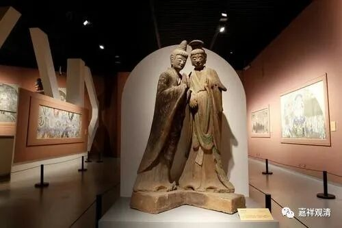

**《善说精髓》084（119）**

** “酉二、用前未说之余理破**

** 分二：戌一、示缘起因，戌二、用此及前理成立无为亦无实。**

** 戌一、示缘起因”**

** **

再用缘起因来说。

按理说，“一切内道皆许缘起，都无差别”，但对具体什么是“缘起”、怎么去解读“缘起”大家的理解还是有差别的。

按《宗义书》里面的说法，声闻部派里，有部是说从因生果的缘起。从源头上来说，声闻（上座）部的缘起说，主要是从十二缘起来谈的，也就是十二因缘。在中观师看来，这属于杂染品的“内缘起”。《十二门论》中说，有情这部分的，叫“内缘起”，此外的，叫外缘起。单纯谈十二缘起，仅是内缘起的“杂染”部分。

佛教史上最重要的一个偈子，缘起偈。这个偈子被当作“法身舍利”刻在（早先规范的）佛塔上，或者装在塔里。这其实是最初舍利子听马胜比丘总结的佛法。

** “诸法因缘生，**

** 如来说是因；**

** 法灭亦如是，**

** 是大沙门说。”**

** **

一般受过大乘经教影响的人，首先便会吧“诸法”的范围当作“一切法”（这个一会儿再说），但声闻上座部系统对此的理解则不然，他们认为这里的“诸法”不是指的一切的存在，而是有情的杂染品身心。对这个偈子，他们是这么对应的：

** 诸法因缘生，——苦谛；**

** 如来说是因；——集谛；**

** 法灭亦如是，——灭谛；**

** 是大沙门说。——道谛。**

有没有觉得很工整？

这里，在中观宗看来，上座部“缘起”的概念就比较窄——仅是内缘起的杂染品部分，并未“普及”到“一切法”。对自宗来说，“诸法”的范围是指一切法，包括有为法、无为法。

另外，还有些部派对“缘起”的理解等同于“缘生”，那样，无为法因为不是“缘”所“生”的，也就不能是“缘起”了。他们认为，“生灭”是有为法，无为法不是由谁所生的，不是“缘生”，就不是“缘起”。所以，他们的“诸法”仅包含有为法而不包含无为法。

这样看来，虽然“一切内道皆许缘起”，但对于“缘起”的含义和“诸法”的范围大小都有不同的理解和诠释。

