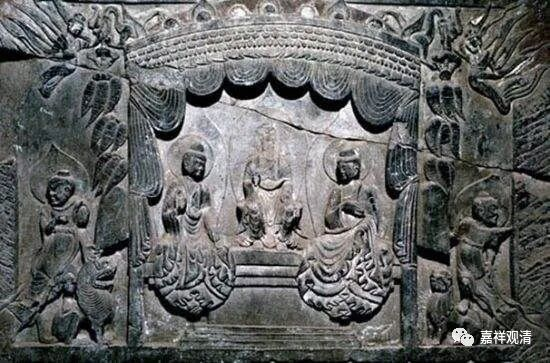

**《微课中观史》36·2**

汤用彤先生认为——好像是先有日本人这样认为，“卅”（sa），三十，应该是“卌”（xi）四十，的抄写错误，为什么呢？大家都觉得这个人不应该这么早死，都觉得他不该三十一岁就去世。反正大家都觉得很可惜，但是以前中国人确实没有提出来是四十一岁去世。不过这也很正常，很多法师刚去世不久，一些他的伪作、传说就传出来了（经常可以发现一些大师的伪作和真的作品几乎同时流行，甚至伪作流传更广……）

现在看起来，四十一岁应该是大概率事件，之前我说过了，最近看了一些墓志拓本和敦煌写本，发现“卌”字在南北朝乃至唐代也是常见的，“卌”误为“卅”确实是很可能的讹写。

前面我们讲过，姚兴一家都是非常信佛的，虽然他有些事情（送女人给罗什，为了要留种）做得比较荒唐，可是，毕竟不会无缘无故杀一个高僧。把僧肇大师的去世原因安到姚兴头上，估计就是那个注解《金刚经》“忍辱仙人被歌利王割截身体”那段的颂子演变而来的。僧肇法师道家也学得这么好，也不会无故得罪他，是吧？在宋代的禅宗灯录中确实有提到过，说僧肇法师是自己写的《宝藏论》，然后交给皇帝看的。什么临刑前求了七天或者借了七天来写书，这个不太可能。

还有个事情我上次说过嘛，刘遗民在他自己的书当中说，僧肇法师写了《般若无知论》，被送到庐山慧远大师的僧团，被刘遗民这些人看到以后，大家就写信去夸他，请他再寄点新的东西给大家看看。这里僧肇法师说过，贫道我身体不太好。这也说明僧肇法师可能年轻的时候身体不太好。前面我们讲过，他小时候家里比较穷，靠给别人抄书来挣钱。所以呢，文化确实是有，可惜哪，命不长。

不过说实话，那个时代，医疗不发达，随便一个外感就有可能挂掉的。那个时候人的平均寿命也就三十几吧。

刚刚讲了“贫道”这个词，其实“贫道”这个词在南北朝时期指的是和尚，不是道士，那时候道士还没什么本事。基本上这个词指的都是出家人，也就是我们现在讲的和尚。也有一种说法叫安贫乐道，类似这样的意思。其实以前“道士”这个词，不是像现在我们讲的“道士”，它指的是出道之士，就是我们出家人、和尚。那个时候我们佛教的这些出家人，才用“道士”、“道人”这个名词。比如“固定搭配”的“方广道人”就是一个例子。

所以呢，我们认为僧肇法师应该四十一岁去世的。四十一岁，年纪也不大，不过已经活过岳飞了……这么聪明的一代大师，四十一岁就过世了，还是很可惜啦，这么聪明的一个人，如果长寿的话，成就应该是不可限量的，罗什一系的中观宗的传承也会更多的保留下来。

这就是僧肇法师。

