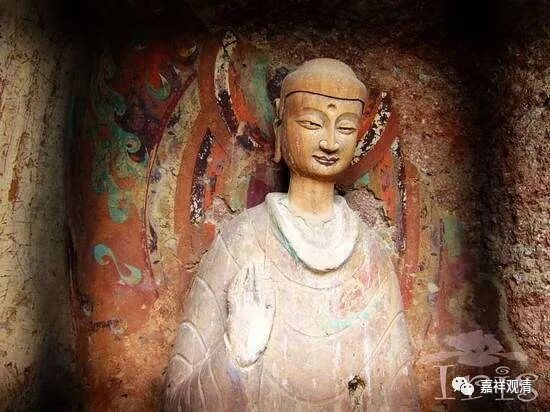

**《善说精髓》084（120）**

这样看来，虽然“一切内道皆许缘起”，都认同“诸法无我”这个法印，但对于“缘起”的含义和“诸法”范围的大小都有不同的理解和诠释。

内道各派都认为“有”是“缘起有”，如果“缘起有”、“世俗有”都不承认的那就叫失坏缘起，失坏世俗的安立了。有一派佛教系统，认为凡夫所见的世俗都是错的，是无；圣者所见的是胜义，是有，于是打出旗号“世俗无而胜义有”，这完全和中观宗相反了，中观宗诸系统都认可“世俗有而胜义空”，所以在中观宗看来，那些人失坏了世俗的安立。而“一切内道皆许缘起都无差别”，那这些人怎么算呢？自宗说，那是皈依佛教，信佛，但是持外道见。信佛而外道见，这个，比例大概……有98%不？

** **

对自宗来说，“缘起有”，即使解释到“世俗有”也还不够（就是说，“缘起有”和“世俗有”都对，但还要进一步精确表达），要进一步解释到“唯名言有”才行。这是因为，自续派在世俗上成立自性有，也就是说，自续说“世俗有”是“自性有”，“胜义空”是“自性空”。

在这一点上，佛护和清辨，也就是应成和自续创派的两位大师核心分歧出现了，《中论·佛护释》说：“外境于名言有，自性于胜义空。”据说宗喀巴大师就是在阅读到这句话的时候，证悟空性的。然后就写了《证道歌》——《缘起赞》。

对应成派而言，任何的，“有”，只能是“唯名言有”；“世俗有”的“有”，也只能是“唯名言有”。同样，诸法的空，只能是“自性空”，乃至胜义的“空”，也只能是“自性空”。这就是离二边的“中道”。

** **

我们在这儿费劲巴拉地讲空有，但对绝大部分人而言属于“多余”（从点击量就可以看出来了，哈哈）。一般佛教的活动，放生，哗啦，来一百多人；念经打坐，少一多半；听课，屈指可数——这个词我用的可不是比喻哦。也是我的能力不够吧……

但是，不追究缘起理，则始终未触及解脱的丝毫。宗喀巴大师在《三主要道》里说：

“不具通达实际慧，虽修出离善菩提，

不能断除有根故，应勤通达缘起法。”

不通达缘起的道理，是不能动摇轮回之根本的！这里的“有”，是指“三有”：欲界、色界、无色界。“三有”，也就是轮回。“有根”，就是轮回的根本，是啥？我执！什么来对治它？缘起理！

