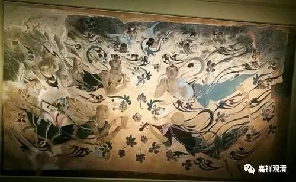

**《微课堂佛教史》037·1**

好，我们继续佛教史，现在讲到中观派在中国的历史。

中观派一到中国就非常的兴盛，好像这也是中观派一个比较有趣的现象，开派的人都比较兴盛。比如说龙树菩萨、提婆菩萨，这两位是开派的，是吧？月称论师和之前的佛护论师也算是开派的，清辩论师和寂护论师也是开派的。好像开派的名气都比较响。

在汉地也是一样，最早的开中观派是谁呢？鸠摩罗什法师。他来到汉地以后，大乘、中观一下子就产生了很大的影响，他的几个弟子也是名头响亮，功不可没。（师父的本事，一定要靠厉害的徒弟来撑住！这也算缘起吧……）鸠摩罗法师门下最主要的四位弟子被称为“四圣”，我们已经讲过其中的两位：僧肇大师年纪比较轻，可是英年早逝，四十一岁就过世了；僧睿大师年纪比较大，是一位非常持重的人物，文笔也非常不错。

那么还有一位呢，比起之前的两位名气丝毫不弱，寿命又长，相比僧睿法师他又比较年轻，独创新学，这个人也是属于中国历史上比较少见的人物。有这样一句话叫“孤明先发”，就是经典还没来全之前，他就把经典后面的意思给推理出来了——不得了啊！这个人是谁呢？竺道生大师，“天竺”的“竺”。

按照我们现在来说，出家人都姓“释”，是吧？那么在当时呢，是以老师的姓为为姓的。出家人姓“释”，这是谁提出来的呢？是由僧睿法师的老师，也是庐山慧远大师的老师——道安法师提出来的，“弥天释道安”的道安法师。那么道安大师之前出家人（也有在家的居士）的姓，是以什么为姓呢？外来的是以国家为姓，后面弟子就跟他“姓”。

比如说从天竺来的，就姓“竺”，弟子也就跟师父姓“竺”，比如竺法兰。

印度西北克什米尔，后来的贵霜王朝是原中国西北的大月支人迁移过去建立的国家，沿用“大月支”之名，姓“支”，比如支遁支道林。

从安息国来的，就沿用国名姓“安”，比如安世高。

从龟兹来的，姓“龟”？那太难听了，于是姓他们国王的姓，姓“帛”或者“白”。罗什大师是龟兹人，按这个规矩来说本来应该姓“白”，他妈就是王族，姓白，但他爹是天竺人，姓“竺”也行。那他怎么没姓白或者“竺”呢？也就是，这个习惯，恰巧到罗什大师来的前后渐渐地退出历史舞台了。道安大师指定的规矩开始流行——大家姓“释”。

从康居国来的，姓康，比如康僧会。

反正就是跟着老师的姓，老师、老师的老师……跟着国姓。

竺道生法师呢，他的时代比道安法师稍微晚一点点。他的老师是竺法汰法师，所以他还是跟他老师的姓。我们再往前推的话，都是从天竺来的，所以他就姓了“竺”。

这个事情一直到后来才统一了，都姓“释”，所以我们的名字前面都挂一个“释”字。外行就不太明白，包括一些佛教的居士也不太懂，管我叫“释老师”的也有，甚至还有某寺院当地工商局的打电话叫我“释总”（为什么不是“释董”）？，很有趣啊。

