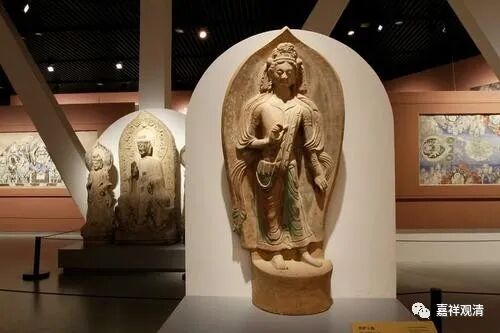

**《善说精髓》084（121）**

** “无有不依因生果，及不待支之有支，”**

** **

** “无有不依因生**”的“** 果**”，没有果法是不依因缘而生的；“及”无有“不”观“待”“支”分“之”“有支”。前面那个“无有”这两个字要管这半个颂子，所以就是“** 及无有不待支之有支**”。“支”，就是支分、部分；“有支”，就是整体。

没有果不是依因缘生的，也没有“能独立于部分的整体”存在。诸法都是依赖于他的。月称论师《四百论释》说：“所言我者，谓诸法之不依仗他性，由无彼性，名为无我……”不依赖他的事物不存在。

《善说精髓》基本上是按着《略论》的科判展开的，《略论》在此科下广引诸经论来建立缘起无自性的教证，如《海慧经》云：“若法因缘生，是既无自性”；《无热恼龙王请问经》说：“若从缘生即不生，其中无有自性生；若法依缘寄说空，说空即是无自性”、“智者通达缘起法，永不依于诸边见”……大家可以阅读《略论》同一科判下的内容。有一本《略论释》，应该是权威解释啦，大家找一下都可以找到。《略论释》也有版本作《菩提道次第大疏》，内容是一样的。

这里要提醒一下，《菩提道次第略论》在外面流通的汉文本子大部分在《止观章》部分有很大的错误。绝大部分流通的《略论》本子的《止观章》都不是《略论·止观章》，而是扎伽大师的《止观讲义》，这个不知道是什么时候误植的，可以做个小小的考证。简单的判断，《略论·止观章》，大陆常见有两个本子，长的那个是对的，短的那个是《止观讲义》。“别学后二度”部分，科判分六的是《略论·止观章》，分四的是《止观讲义》。大陆流通的本子里，《略论释》的本子是对的，《中国佛教典籍选刊》的《略论·止观章》是对的；佛学书局和西安交大版本的《略论·止观章》都不对；对岸新译的如性法师本的《略论》是对的。

当年我们九十年代在读《略论》的时候，这两个本子这么大的差异把我们绝对搞晕了——这完全不像是两个译本的差别，而是不同的两个文献嘛！当时我们看的是《中国佛教典籍选刊》本和佛学书局本。那个时候教学资源不像现在遍地都是……

