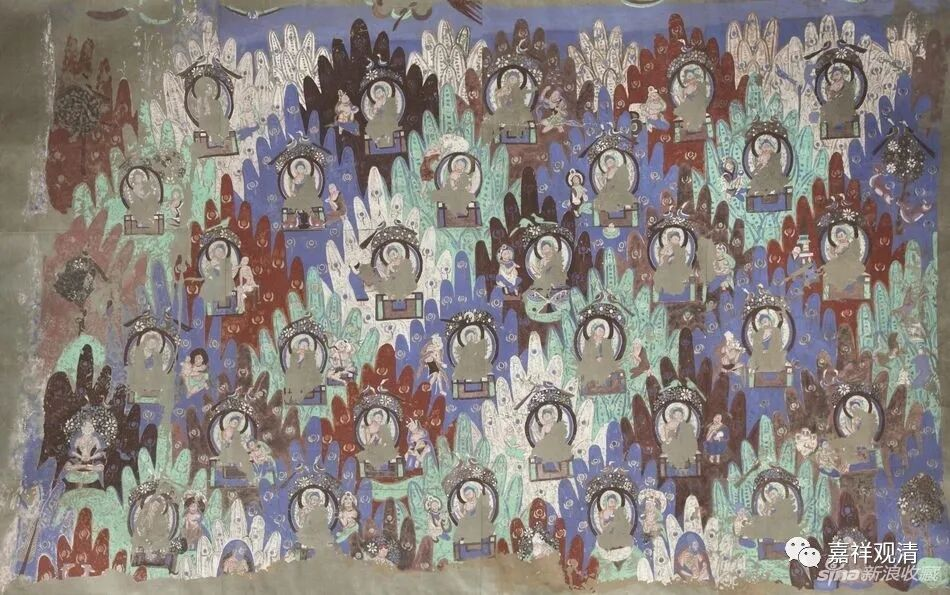

**《微课中观史》37·2**

那么，竺道生法师是哪里人呢？他是河北人。他家住在哪里呢？他的家在徐州，是一个官宦人家，所以他和僧肇法师就不一样了。僧肇法师可能从小就家境贫寒，给别人抄书。竺道生法师就不一样，从小家里的条件比较好，出家年龄也比较早，比僧肇法师出家的年龄还要早。他很聪明，也是很年轻就出名了。我一直说南北朝时代的人才出太多了，而且都是很年轻就出名了。

竺道生法师十五岁就开始讲经，不到二十岁就出名了，然后二十岁受具足戒。他出身官宦人家，本来就是士族阶层，文化水平也比较好，不像僧肇法师那样自学成才，他是有老师的。

我们刚才提到一件事情，就是他的家按照我们现在来说是属于北方的，在江苏北部徐州。徐州以前不是属于江苏一带的，而是属于中原一带的，他的家住在这个地方，然后他去了哪里呢？竺道生法师听到鸠摩罗什法师来了以后，就去了长安，还是活动在北方。他很快就成为长安的鸠摩罗什法师学僧当中的一个出名人物，大家都觉得这个小孩非常聪明。

现在都说他在鸠摩罗什法师那里待了很长时间，但实际他待在鸠摩罗什法师身边的时间，至少是没有僧肇法师和僧睿法师长，后两位法师基本上是从头学到底的，而道生法师其实只待了不长的一段时间。其中有一点大家应该想一想：道生法师是把僧肇法师写的《般若无知论》带到了庐山僧团，带到庐山慧远法师那里去，说明他那个时候是离开鸠摩罗什法师的。

虽然他学的时间并不是很长，但确实学到了不少东西，而且是跟着大师比较系统地学习的，所以才会出现后面的“孤明先发”。

应该说，所谓的“孤明先发”也不完全是“独出胸臆”，应该看到，后来道生法师所提出的一些“特别”的观点，都可以在罗什翻译的《大智度论》里找到影子。可以猜测的是，这些观点都由罗什传授过了，而只有顶尖的几个人真正理解地化为了自己的东西。

他的中观学应该也学得不错。鸠摩罗什法师在翻译的时候，虽然没有直接翻译涅槃系的经典或者翻译《涅槃经》，但是对《维摩诘经》、《法华经》都有译讲，道生法师跟着学到不少东西，这些学了以后呢，对他以后的慧解打下了非常扎实的基础……所以先学论还是很重要的。

