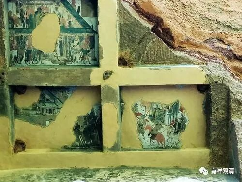

**《微课中观史》37·3**

那么，道生法师比较早地离开了长安的罗什僧团，先去了庐山。庐山在当时有一个在比较重要的僧团，就是慧远法师所带领的庐山东林寺僧团。我本来还以为东林寺在庐山里面，其实东林寺在庐山的北边，离庐山还是有一段距离的。慧远法师在当时受到了南方的朝廷、官家、民众等几乎所有人的推崇，这里面不仅有他佛学水平方面的原因，还因为他在儒学方面的很高水平，属于清净传承的名家吧，以及对玄学的一些典籍也很熟悉。

道生法师去庐山僧团拜访的时候，就和大家聊起了在鸠摩罗什法师那里所学的内容，并且带去了《般若无知论》——后来《肇论》当中的一部分，然后也在那里结交了一批南方的士大夫。他本身就是那个阶层的嘛，融入那个圈子也很容易。

我再给大家描绘一下南北朝时期的整体形势，是什么情况呢？南边在这个时候是属于东晋的，相对来说政权是比较稳定的。而北方是五胡乱华时期，非常的混乱。那么，以道生法师为代表的一些文化僧人就纷纷南下，因为南方的学术氛围比较好，相对来说社会也比较稳定，经济条件也比较好。原先北方的士族随朝廷南下以后，在以前比较蛮荒的南方就进行开垦，就有点……能不能说像殖民呢？反正就是新的文化中心南移了。

文化中心的南移，也有个特点……最近我们做了个关于佛教的历史地理研究，总结出一个现象，基本上佛教文化名人的活动都在交通要冲。古代南方的水运很重要，南方人更是被北人称为“岛夷”——因为地块都被河网分割。南方的水系的交接点往往成为交通要冲、文化重镇，也是军事重镇。古代南方的的河网就相当于今天的高速公路。这样，南来的僧侣主要集中地点就在这几个地方了——九江（庐山）、徐州、南京、扬州、苏州、绍兴……这几个地方后来都有三论系的据点。

九江的南面的庐山就是这样一个佛教僧侣的聚居地。后来的禅宗、三论宗、净土宗都有名僧在庐山驻足讲修。道生法师从长安回来，先去了庐山，拜访“学界大佬”僧界领袖庐山慧远大师，在庐山僧团就认识了很多南方士大夫阶层的人，然后他就去了南方的政治经济文化中心，也就是今天的南京。他从九江顺流而下，就从庐山到了南京。

作为新秀，那是“拜访长老"，作为长老，那就要"提携新人"。看起来道生法师有这个意思，庐山慧远大师也成全了这个可畏的后生。这次拜访庐山僧团给道生法师留下了很亲近的印象吧，庐山僧团也完全肯定了这位新秀，拿今天的话来说，他在庐山收获了很多粉丝。后来道生法师被南京的僧团摈出（赶走），先去了苏州虎丘（虎丘后来一直到盛唐时代都是中观的重镇，清凉澄观法师年轻时候在那里学过三论）。最后，道生法师是在庐山讲经的法座上讲经的时候，拂尘一落，圆寂的。

鸠摩罗什法师到了中国以后，全国的僧人都往鸠摩罗什法师那里跑，很多人也就是镀镀金然后又回去了。这时候道生法师的好几个同学，就是原先在长安的同学，都回到江南，在南京成为学术界的大佬了。具体的名字我就不说，名字我是记得的，但是说名字不太好意思。而道生法师那个时候在南方也是名气非常响亮的。

下一章，长安的同学之间要缠斗了……

