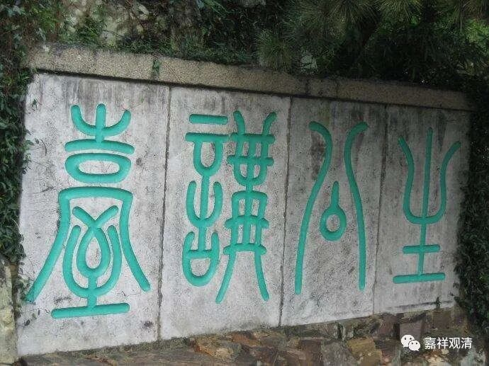
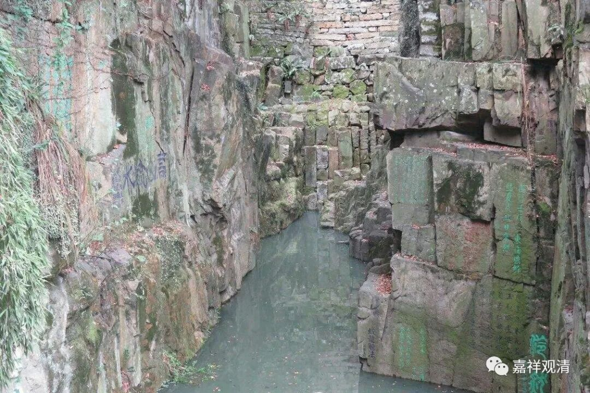

**《微课中观史》38·2**

道生法师提出“一阐提皆可成佛”！这下捅马蜂窝了。因为当时大家都是按照已经翻译的《涅槃经》在讲，那么在《涅槃经》的文字上是很明显的，就是在前面六卷的文字当中很明显地说一阐提是不能成佛的。道生法师你作为一个和尚，居然敢跟佛讲的不一样，而且还振振有词？你居然敢说你这个说法肯定是对的，《涅槃经》一定是这个意思，那就不行了。

当时他的同学某某法师（我不说这个人的名字），几乎是以他为上首的，带着大家就表决了：我们这里有个兄弟，现在胆子太大了，居然敢反佛。直接就把这个大帽子扣了上去。经典里面讲一阐提这类众生是不能成佛的，他居然说一切众生都能成佛的，这个跟我们佛教讲的不一样。然后大家进行集体表决，就把道生法师赶走了。（本是同根生，相煎何太急……）

这多没面子啊——当然这句话是我说的。道生法师则说：“我所说的一定是经文的原意。你们这些人都是死在文字下面的，都是智慧不够，所以看不懂经典的意思。假如我说错了，我不得好死。假如我说的是对的，将来我在法座上讲法的时候圆寂。”这就有点像赌咒发誓一样。

那个时候也没人听他讲课了，他就离开了建康（现在的南京），去了苏州，到了苏州的虎丘。现在虎丘有一个景点叫“生公说法，顽石点头”，那里有很多摩崖石刻。有个“生公说法台”，前面有很多很多的岩石啊，都是歪着脖子的。那个地方刻了很多名家的字，如“石点头”之类的。反正从东晋以后，能写字的，不能写字的，都往上刻几个字。传说道生法师到了那里以后，讲经给谁听呢？没人听。台下的都是些石头，他就讲课，讲释迦牟尼佛说一切众生都能成佛，然后这些石头都点头了。这肯定是一个传说了。

石点头

生公讲台

乌泱泱的刻石

说起来道生法师为什么到虎丘去呢？虎丘肯定有他的同学，因为中观派这一系到后来比较重要的几个地方当中，苏州虎丘是一个，绍兴是一个，镇江附近是一个，然后南京是一个，再往西一点庐山是一个，再往内地就是成都。基本上按照长江一线排开，都是中观一系的重镇。虎丘到底是道生法师去之前还是去之后成为中观重镇的呢？那肯定是之后了，因为道生法师相当于本土第一代的中观派人物。

后来在河西走廊这一带，昙无谶法师把全本四十卷的《涅磐经》给翻译出来了。在这部完整的《涅槃经》里面，果然有一阐提皆能成佛的说法。

这下事情搞大了，因为之前是由于这个讲法专门把道生法师赶走了。现在一看：人家真是对的！只能说明人家太聪明了，看到前面的文字，居然能够猜到后面的文字。整个佛教界都轰动了，中国的佛教界全都轰动了，大家把道生法师称为什么呢？称为大经未来之前“孤明先发”。全本的经典还没翻译出来，他已经把后面的理论给推理出来了。于是他被直接被封圣了，大家叫他“涅槃圣”。

历史就是这样荒谬——能“封圣”的是其实是一群糊涂蛋，由他们来认可一位顶级大师。

