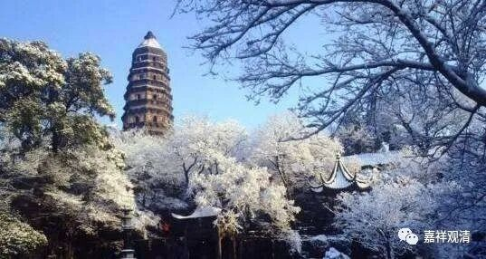

**《微课中观史》38·3**

我们现在来看看，为什么大经未来之前他能够推出“一切众生皆能成佛”的讲法。

其实他也是学来的。那个时代已经翻译过来的经典里面已经有了“众生皆可成佛”、“究竟一乘”的说法。他在长安的时候跟随中观派大师鸠摩罗什学习的这段时间当中，接触到了中观派的可以说是最核心的内容，对中观的教理也有比较系统地学习。相对于他的系统学习，那些建康的名僧们的拿着经典百般琢磨的，最多也只能叫自学。

在他所学习的那些经典当中，很重要的一部或者说是一系列是哪些呢？我们不要忘记，中观派不是讲究竟三乘的，也不是持五种姓说的，中观派认为是“究竟一乘”的。而且鸠摩罗什法师很注重对中观系统教材的全面介绍，《般若经》和《法华经》都翻译过来，并在译场做了讲释。《法华经》当中很明确地说“会三归一”，什么意思呢？就是声闻、独觉、菩萨最终都会走上究竟的大乘，三乘人最终都会成佛，再往前推一推，就是一切众生都可以成佛。

那么“五种姓”说，在中观宗是认为是不了义说的。首先，中观宗视为了义经的《般若经》中只有四种种姓，声闻、独觉、大乘、不定（其实即便在唯识宗，即便承认五种姓说，也要说实际只有四种种姓，无种姓是“假名种姓”，就像你不能说“我这里有五个人，其中一个是‘没有人’”）。据《般若经》，解脱有四种种姓，据《法华经》，三乘终归佛道，究竟都要成佛，那顺下来岂不就是“一切众生都要成佛”吗？

所以说，虽然道生法师在当时“孤明先发”地说“一切众生皆有佛性”，但这个观点并不是他个人的“创建”，我们认为至少这个说法应该是学有师承的，这个是中观派最根本的观点，只是以前没有把经典系统地翻译过来而已。凡是现在学过中观派的经典和理论等等，也知道中观派是认为一切众生皆能成佛的，是认为究竟一乘的。《法华经》怎么说的呢？认为是究竟一乘的，“方便有三”，“会三归一”，所以没有哪个众生是不能成佛的。在当时《法华经》已经翻译过来了，《中观论》都已经开始弘扬了……

如果以此为背景的话呢，就可以理解竺道生法师是如何能够做到“孤明先发”了。

至于他那个同学呢，老实说，虽然好像是在“十哲”的名单当中，但是水平跟四圣比起来，真是不咋样。（当然，我说的不咋样，也是一番说说，我说了不算。）为什么说他不咋样呢？因为他跟着谁，他的观点就跟着变，有点接近于唯识里面讲的“不定种姓”。他跟谁学，观点就跟谁变——他跟罗什学，成为“十哲”，算中观吧？后来学了毗昙，他的观点又变成小乘了，因为有人过来翻译、介绍了一些小乘的经典和修法；《涅槃经》前六卷来了，他“双”变了；后来《涅槃经》全本译出，他“叒”……“叕”……每次学界、教界流行啥，都有他……

这是他自身后天学养的问题，还是天生的？这个很难讲。唯识里面说的“种姓”恰好和这个有关：是本有？还是新熏？这位法师也是“十哲”当中的一位，名字我就不讲了，你们也别去查了。所谓“做人留一线，日后好相见”，万一哪天谁谁托梦说他是我前身，那多不好意思。

那么，今天竺道生法师的事迹就先讲到这里，还没讲完呢。他真的是非常了不起啊！不过，我们是学中观的，有果必有因，这些故事也是有背景、有原因的，“孤明先发”也是有原因的。

