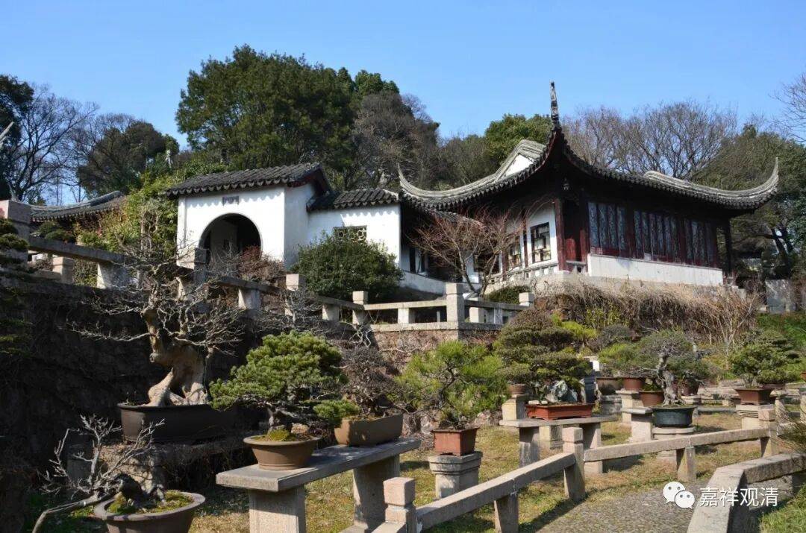

**《善说精髓》084（126）**

** “色等诸事唯世俗，断无明者之所见；”**

** **

“色等诸事”“唯”是“世俗”——此是“断除无明者”之所见。

** **

** “具实执人实执前，实故诸事名世俗。”**

** **

而此（“色等诸法”）在** “具”**有** “实执”**的** “补特伽罗”**的** “实执”**面** “前”**，现为谛** “实”“故”**，** “诸事”**此名为** “世俗”**谛。（这里颂文最后的“世俗”应当理解为“世俗谛”）

上面两句合说：

1、“世俗谛”这个词里的“世俗”是实执——在凡夫（具有实执的人，这里如果单用“凡夫”还需要辩论一番）的实执面前，色等法都现为谛实。

2、色等诸法在实执（即这里的“世俗”）面前现为谛实，所以说色等诸法是“世俗谛”（这不是讲什么道理，这只是说“世俗谛”这个词的来源）；

3、色等诸法，虽称为“世俗谛”，但并不是说它必定会现为谛实——在断除无明实执的人面前它仅现为世俗，而不现为“谛实”。注意，这里的“断除无明实执的人面前它仅现为世俗”的“世俗”，不是“实执”，不是前面说的“世俗谛”构词结构当中的那个实执“世俗”。

** **

4、并不是说“在实执面前现为谛实”的就是世俗谛，比如，胜义谛，胜义谛虽然在实执面前现为谛实，但胜义谛不是世俗谛。

** **

串起来说呢，其实就是一个梵文的拆字，外面人看得一头雾水。其实就是印度小学老师在教大家查字典：

“大家翻到梵文字典第几页，看看，‘世俗’这个词有几个意思啊？”

三个！

“那三个呀？”

1、障真、覆盖；2、世俗名言；3、相待、互相依赖！

“那，‘世俗谛’的‘世俗’是用那个解释呀？”

第一个！

“对了，真聪明！”“再继续，声闻罗汉见的‘世俗’能用这个解释吗？”

不可以！

“为什么呀？”

因为声闻罗汉见色等法，不现为谛实，声闻罗汉见的法本身‘不障碍见真实’……

“很好！”……

** **

上面这一段，就是《入中论》中所说的：

**
**

“** 痴障性故名世俗，假法由彼现为谛；**

** 能仁说为世俗谛，所有假法唯世俗。”**

**
**

