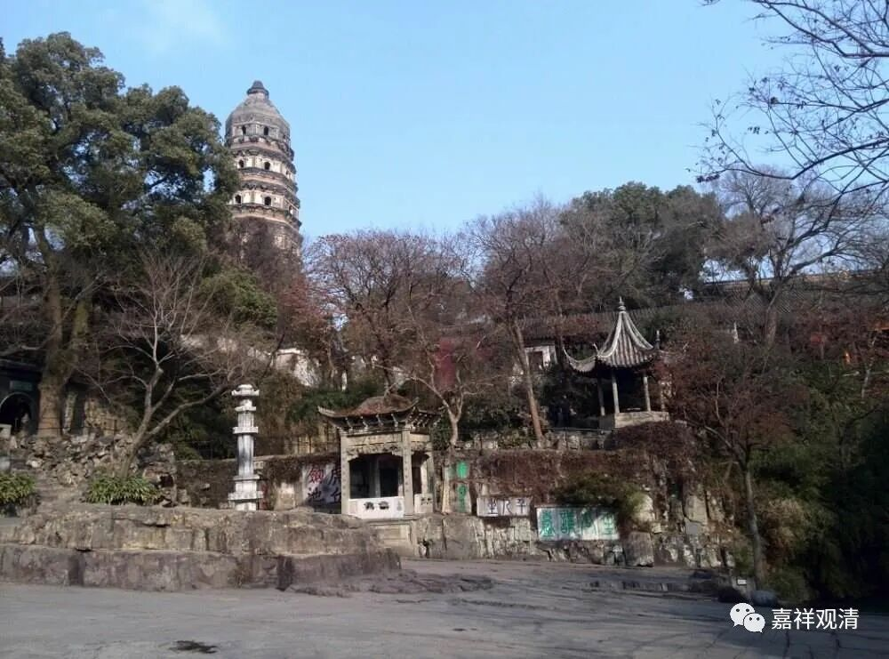

**《微课堂佛教史》039·1**

好，我们继续佛教史。别人都去吃圣诞大餐了，我们也吃吃我们的菜。(讲课的这天是圣诞节。)

佛教史已经讲了印度中观派的一点历史，只能说是讲了我自己所了解所知道的那一点。现在讲到汉传中观派的历史，讲到鸠摩罗什法师和他的弟子们。鸠摩罗什法师号称弟子三千，跟孔先生有得一拼。实际上，真正特别出色的应该是十个手指头数得过来，虽然说有“四圣、八俊、十哲”，最出色的也就那几个，有太多的超一流徒弟也不太可能。

鸠摩罗什法师的弟子当中的“四圣”就是：僧睿法师、僧肇法师、道生法师、道融法师。很可惜的是，道融法师没有什么文字留下来，他和道生法师是齐名的。这两位法师的情况有点接近，怎么说呢？就是他们都是以理解意思为主的。用我们现在的话来说，就是在解释文字和文字背后的义理方面，他们是更倾向于玄辨、玄解的。僧睿法师是一个老成的学者型人物，同时也很专注禅修。僧肇法师呢，也是少年成名。

前面我们讲了道生法师的寿命比较长一点，同时也是世家子弟，另外一方面，他的慧解也是很早很早就出现了。道生法师很早很早就出名了，十几岁的时候就开始讲经了。我们前面还讲过，在《涅槃经》的翻译全本传入江南以前，他的那个令人不可思议的事件，就是在完整的大经到来以前，道生法师“孤明先发”。

当时《涅槃经》早期只翻了六卷，在这六卷当中说，“一阐提不能成佛”，或者说“不是一切众生都能成佛，要除了一阐提”。大家都认为经典的这个文字可以如言取义，因为那个时候佛经刚刚传入或者被翻译后进入到汉地，大家都是以经为本的，经说了算。

这是中国文化的一个传统，儒家规定，“经”的地位要高于章疏。自汉代起便明确，经（律）用纸（竹简）宽二尺四寸，传（注解）一尺二寸，地位分明，不得擅自变动。所以国人习惯上便重经轻论。现在佛经文字确凿，自然以教奉行之……

突然之间，有一位法师突然站出来说，一阐提也是能够成佛的。这就和经文的意思完全不一样的，在当时直接就轰动了。于是大家就把这位道生法师赶走了，而且是开大会摒除的。

后来道生法师就去了虎丘，现在应该也算是寺院吧？在以前是吴王阖闾待的地方，那里还有一个塔，是吧？我们如果能够看到塔的话，基本上以前这个地方都是有寺院，基本上是这样的。道生法师在虎丘留下了很有名的故事——“生公说法，顽石点头”。再后来道生法师又去了庐山，他和庐山僧团的关系很好。他早期的时候曾经去过庐山，回南方的时候也去过，之后又在庐山讲经，最后圆寂也是在庐山。

