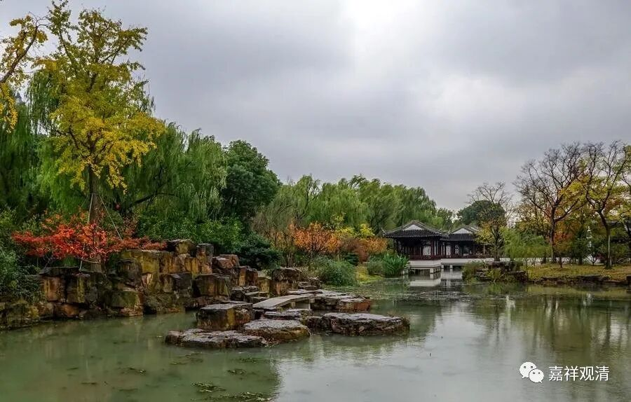

**《善说精髓》084（127）**

** “世俗谛非实执成，惟实执前是谛实，”**

** **

** “世俗谛”“非**”是由“** 实执**”而“** 成**”立的，“** 惟**”其在“** 实执**”面“** 前**”成立它“** 是**”“** 谛实”。**

** **

这一段还是上面讲的意思，你不要把他当定义理解，这是说，色等诸法是世俗谛，作为他“是世俗谛”这块，不是由实执来成立的，是什么呢，是实执把他（世俗谛）当成是谛实有的。还是这个意思，“在世俗（这里的‘世俗’，月称解释为实执）面前现为谛实”是名字的来历，不是定义，在这个名词的来历里面，“世俗”的意思不是说的依赖、名言，说的是实执。

** **

** “然非立为世俗谛。”**

** **

“世俗谛”（色等法）是在实执面前表现为谛实，** “然**”而，世俗谛“** 非**”是由实执“** 立**”为“** 世俗谛**”的** 。**

** **

月称依据“世俗谛”的梵文释词展开他的理论，世俗谛的定义在后面。

** **

** “断除实执诸人前，立世俗分不立谛，**

** 然则立为世俗谛。”**

** **

换一面来说。

在** “断除实执”**的声闻、独觉、菩萨** “诸人”**面** “前”**，色等诸法** “立”**为** “世俗分”**，而** “不”**安** “立”**为** “谛”**实，** “然则”**，但是，色等诸法可以安** “立为世俗谛”**。

串起来，在实执面前，色等诸法现为“谛实”；在无实执的人、无实执的心面前，色等诸法不现为谛实、仅现为“世俗”——色等诸法是世俗谛。

“色等诸法是** 世俗谛**”，这个“** 世俗谛**”的“** 世俗**”，是指“** 实执**”，不是“无实执人所见的那个世俗”的“世俗”的意思。“世俗谛”的“谛”，是“在实执前现为谛实”的“现为谛实”意思，不是“四谛”中“谛”的意思。

回过来，看这一段的科判，看见没，“** 戌一、释‘世俗’与‘谛’字义**”，就是把“世俗谛”拆开，说“** 世俗谛**”这个词里面，“** 世俗**”是啥意思，“** 谛**”是啥意思。

问：那“世俗谛”的“世俗”是啥意思？

实执！

问：“世俗谛”的“谛”是啥意思？

现为谛实！

问：“世俗谛”这个词说的啥？

在实执面前现为谛实！

问：那是不是所有“在实执面前现为谛实”都是世俗谛啊？

不是！这只是一个词语来源，不是定义！比如，胜义谛符合“在实执面前现为谛实”，但胜义谛不是世俗谛！也就是说，“在实执面前现为谛实”，不是“世俗谛”的定义！

累啊！

        修改于