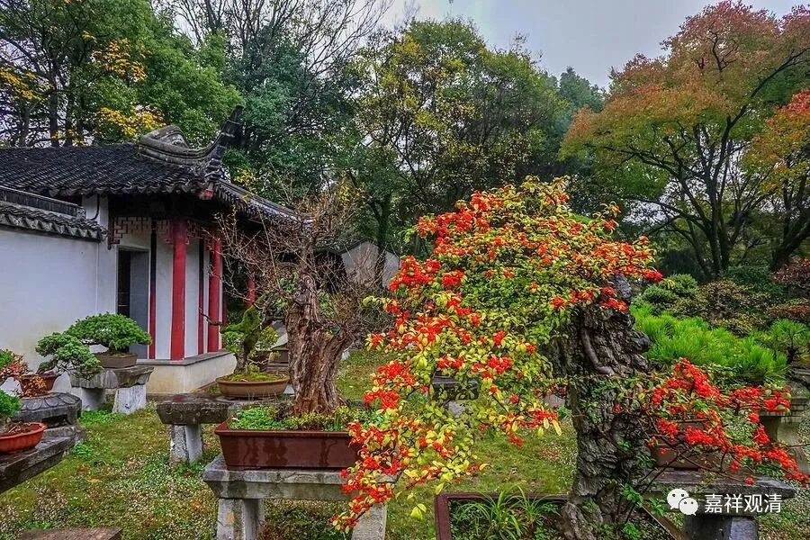

**《善说精髓》084（129）**

** “戌三、世俗差别”**

接着谈世俗谛的差别，这里的“差别”，就是分类。有时候我们看同一个翻译的本子，有些翻译成“差别”、有些翻译成“分类”，都有。

** **

** “许自相识自续师，许境正倒识则无。”**

** **

承** “许”**有** “自相”**的心** “识”**的中观** “自续师”**，他们承** “许”**在** “境”**上分** “正”**世俗和** “倒”**世俗，在** “识”**上** “则”“无”**正倒之差别。

中观师中的自续师，在世俗谛上，以心为有自性、有自相，所以称他们作“** 许自相识**（的）** 自续师**”，颂文要凑字数，其实单说“自续师”似乎也可以。

自续师说，心上不分正世俗和倒世俗，但在境上分正世俗和倒世俗。他们认为，内识在世俗谛上“如现而有”，所以不分正倒；但在境上，是否“如现而有”则有二，即有作用和无作用，由此故分正倒。这种说法出自智藏论师的《二谛论》，《二谛论》说：“所现虽相同，然有无作用；故当分世俗，有正倒差别。”智藏论师被视为中观自续顺瑜伽行派的大师，所以这个说法应该算在自续顺瑜伽行头上。至于清辨论师，很可能没说过这个话，不然也不会拿《二谛论》来说话。

《二谛论》现在还没有汉译本，LSH讲过两次，但没有形成翻译的文字。英文版有一个，据说被国外学界批为伤心之作。不知道听过课的兄弟们中间有没有人有意思出一个汉译本。怕被骂得话，可以署个笔名嘛！

《二谛论》的意思是：外境上，真实的水是有作用的，是“正世俗谛”；阳炎之水没有作用，所以是“倒世俗谛”；龟毛兔角属于毕竟无，不是法，非存在，于世俗为倒，不是“倒世俗谛”。见真实水的心和见阳炎为水的心则不分正倒，因为在心上确实现起阳炎是水的“如现而有”。阳炎，就是沙漠戈壁上看起来“波光涔涔”地觉得是“水”。

阳炎这个东西，单纯知识上知道是没感觉的。二十年前我去敦煌，戈壁上坐着大巴，在前排和韩国留学生辩论“东北是谁们的”。远远看出去，好像路左边很远处有湖。我心里还纳闷，“这里不是戈壁沙漠吗？”于是问司机大叔：“那里是有个湖吗？”司机大叔回：“没有！”……到第二天我才“突然”反应过来，这就是“阳炎”！你看它的时候，真的觉得就是一片湖啊！

