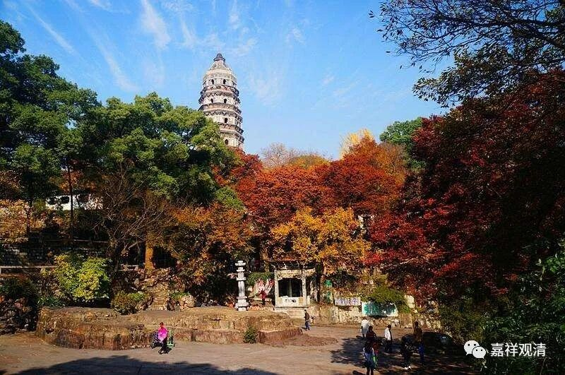

《微课堂佛教史》040·1

好，我们来说说道生法师有哪些比较重要的观点。

其中最重要的，对中国佛教来说曾经是一个长期的辩论课题，就是顿悟和渐悟。或者说大顿悟，或者说渐修，这个问题到底要怎么说？其实这个问题最初被提出来，就是在道生法师这个时候。当时有几种说法，第一种是顿悟和渐悟，第二种是大顿悟和小顿悟。

那么，道生法师提出的是大顿悟说。按照“大顿悟说”的这个文字，仅仅是合理地把文字稍微变一变，那就是——顿悟成佛，这是肯定没有问题的。而且是大顿悟，只要你那个时候到了，就是佛了。这个我就不多加解释了，在文字里面可以有很多种解释。还有什么呢？禅宗里面还讲见性成佛——这个背景也是源自道生法师这个“大顿悟说”。那么，道生法师的这种说法又是从哪里来的呢？实际上还是从《般若经》里面来的。

但是很有趣的的是，他的同学而且水平也不逊于他的僧肇法师是怎么说的呢？僧肇法师一般是说“小顿悟”的，那“小顿悟”的说法是什么呢？说七地是有个顿悟，再后面就是佛地了。大乘的第七、第八地之间是个关键，七地称为“得无生法忍”——在无生法上安忍不动。所以称七地为“顿悟”。但相比“佛地顿悟”的大顿悟说，七地不及佛地，所以称为“小顿悟说”。再有一些说法就是所谓的渐悟——一点点地悟，或者渐修等等。

这个问题其实不像我们有些人所理解的那么难，但也不是那么简单。我们如果往前稍微推一下的话，是可以推出来的。这个其实是基于《般若经》的说法。不管是中观宗还是唯识宗的这些想法，这两派的观点都是可以推一推的。

在《般若经》传入汉地以后，包括中观宗的一些教典开始成建制地传入以后，应该说，对中观派比较了解的人就会具有很明确的教、道、果（我们经常听到的说法是教、理、行、证）的想法。可以说在此之前，大小乘的教道果的这个想法，在中国是比较混乱的，没有理清楚过。那么，中观宗以一个宗派的形式进入中国，并且对大乘的教理、修行和果位都有很详细的阐述。

这个阐述又是依于什么呢？依于《般若经》和《十地经》——就是《华严经》的《十地品》。所以，鸠摩罗什法师又专门重新翻译了《十地经》，并且还翻译了它的注解——龙树大师的《十住毗婆沙论》。稍后呢，唯识宗也翻译了唯识系统的《十地经》的注解，叫《十地经论》。《十地经》，是《华严经》的一部分，就是《华严经·十地品》。以前鸠摩罗什法师翻译的时候称之为《十住》，所以把它的注解翻译成《十住毗婆沙论》，毗婆沙就是分别说，对《华严经·十地品》做广分别，所以称为《十住毗婆沙论》。《十住》，又称为《十地经》，或《十住经》，魏晋时期它先是单行的，是独立于全本的《华严经》而单行的。因为《华严经》实在太长了，《十地经》可以说是《华严经》中最核心的部分，最重要的部分。

