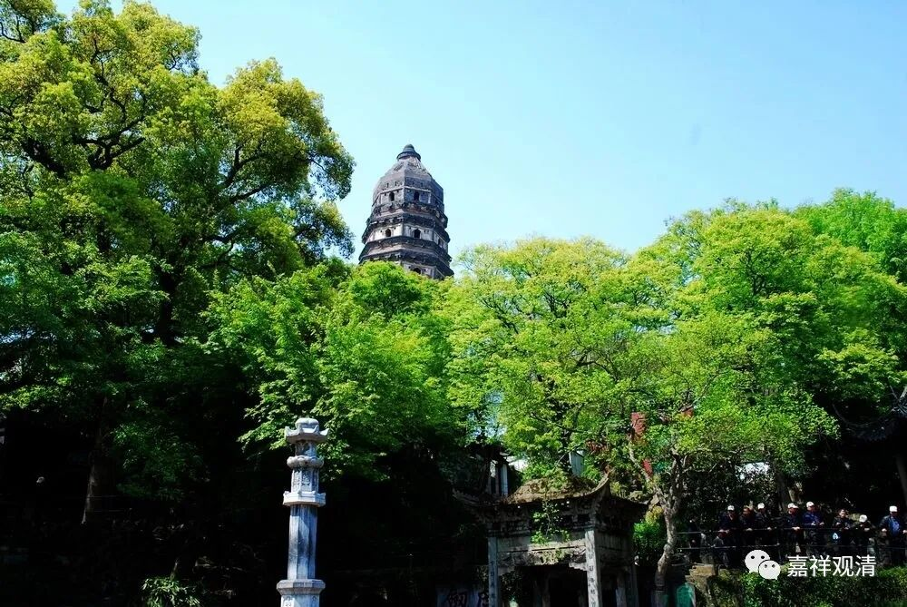

**《微课中观史》40·2**

在《十地经》当中提出了菩萨在果位上的差别。一般从小乘佛教来说，有资粮道、加行道、见道、修道、无学道，是吧？而在《华严经》这部经典当中说有菩萨十地。《般若经》当中也有说十地，从干慧地开始，性地、八人地……往上到独觉地，最后到佛地，有点不一样。

这样，菩萨果位的建立通过《般若经》和《华严经》就讲得比较完整了，然后再由中观派的祖师进行诠释。龙树菩萨写过大乘的《十住毗婆沙论》，月称论师的《入中论》基本上也是按照《华严经·十地品》来写的，如果你们有兴趣的话，可以对照一下《入中论》和《十地品》。《入中论》除了第六地那一段，其他基本上都是用偈颂的形式把《十地品》给写出来的，也说明了《十地品》在中观派的重要程度。

那么，《十地品》被翻译出来以后，菩萨圣道的阶次就出现了，有初地、二地……一直到十地，这就非常明显地出现了证圣果位的菩萨的阶次。

如果大家听过佛教宗义——也就是佛教宗派的观点的话，应该听到过，按照小乘佛教所理解的方式去成佛的话，是在资粮道的上品的菩萨位，坐到金刚座上的时候还是资粮道上品的凡夫，在这一座中就成佛了，等他起座的时候，就已经成佛了。所以在小乘佛教中所讲的三大阿僧祇劫再加上一百劫的这些修行当中，释迦菩萨始终都是凡夫。

如果要想和释迦菩萨一样去修行成佛的话，中间都是凡夫，就是在三大阿僧祇劫再加上一百劫期间都是凡夫。一般人接受不了，这个太难了！那么长的时间，都是带着烦恼在转啊转……所以在中国佛教里面一直有这样一句话，叫“留惑润生”。是什么意思呢？为什么要这样呢？就是说菩萨要留着烦恼不断，这样就可以在轮回当中，来“润生”——度众生，帮助众生，这叫做“留惑润生”。

菩萨成佛需要“留惑润生”，这种说法的来源其实是出自声闻系统的理论，是声闻部派中的关于怎么成佛的说法。大乘不是这么说的，小乘的菩萨三大阿僧祇劫再加上一百劫期间都是凡夫，大乘的，一般说菩萨在第二大阿僧祇劫之初就已经是圣者了，第三大阿僧祇劫之初则已经是八地菩萨。而且依《瑜伽师地论》的说法，菩萨急切断烦恼的心还要胜于声闻——自身不强烈地厌弃轮回，怎么可能去教导别人远离烦恼呢？！若依龙树《大智度论》，连固定的“三大阿僧祇劫”的说法都不是大乘的主张，凡应断者断、应证者证，便成佛道，哪有什么固定数字让你去积累功德分的。

        修改于