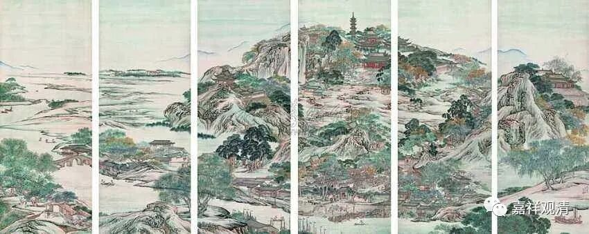

**《善说精髓》084（131）**

** “酉二、释胜义谛**

** 分三：戌一、释胜义与谛字义，戌二、释胜义谛相，戌三、释胜义差别。**

** 戌一、释胜义与谛字义”**

** **

再谈“胜义谛”。

还是分三个部分，释词、定义、分类。

释词部分还是一样，把梵文的“胜义谛”这个词拆开，“胜义”和“谛”各自解释。就像做哲学家的套路就是，找一个词，拆开找到拉丁语词根，然后自己发挥一下，再给予和之前不一样的定义，然后给予解释，最后在自己的书里面反复提到“它”~~好像和这里套路都一样嘛。

** “是义复胜故胜义，彼无欺诳释为谛。”**

** “是义”“复**”是殊“** 胜”，“故**”名为“** 胜义”，“彼**”胜义即“** 无欺诳**”，所以** “释为”“谛”。**

** **

首先，是“义”，“义”，就是“境”。胜义谛是境，所以第一句，是义。

第二，它同时是“殊胜”的，这个“义”是“殊胜”的，因为它是胜义理智的所缘境，所以是“殊胜”（2）的“境”（1）。“胜”的就是“义”，“义”是“胜”，所以说“** 是义复胜**”。类似于我们说“明月”，明指向月，月指向明，说的是一个东西。

第三，还是它，因为它（胜义谛）是无欺诳的，所依是“谛”。这里的“谛”就单纯是是真实的意思。

这个拆词，他说的是，胜义谛这个词里面，胜义谛、胜、义、谛、胜义，都是一个东西，都指向一个东西——胜义谛。

月称论师在《明句论》里说：

** “即是义，复是胜，故名胜义。即此谛实，故名胜义谛。”**

** **

宗喀巴大师《菩提道次第略论》说：

** **

** “此许‘胜’与‘义’，俱指‘胜义谛’。”**

** **

这里，“胜义谛”的释词和“世俗谛”不同，“世俗谛”的“谛”是“现为谛实”，“胜义谛”的“谛”是真实、不欺诳。

这个和自续师的拆字略有不同。自续师拆字后的解释是，“胜”是指胜义理智、无分别智，无分别智的境，就是“胜义”……自续师的说法，“胜”是心，“义”是境，“胜之义”，叫“胜义”；应成师的说法，“胜即是义”，叫“胜义”。梵文的语法里面，前一个自续的拆词，认为“胜义谛”这个词是“依主释”（A之B）；后一个应成的拆词，认为“胜义谛”这个词是“持业释”（A即B）。汉语语法里面，“持业释”可以归在并列词组中的某一类，“依主释”就是偏正词组。

天竺大佬们拆字，背后是要抢话语权。我们“外国人”瞪圆眼睛看着：还你们来，你们说了算！

