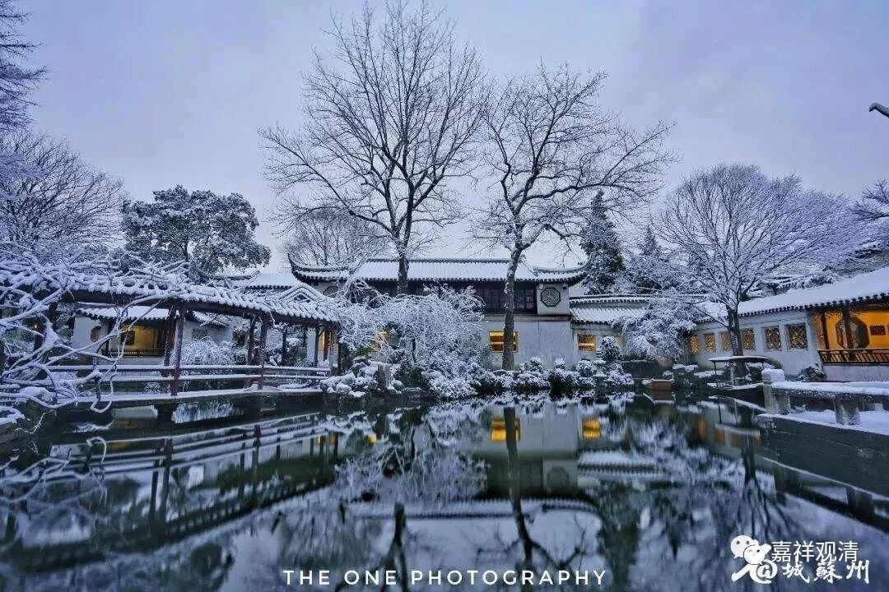

**《微课中观史》40·3**

我讲这些的时候，你们要听得稍微仔细一点，这些观点其实和后来道生大师提出的观点都是有关的。可以说，道生大师当时在鸠摩罗什法师那里学习了很多中观派的成建制的内容以后，他是觉察到了印度宗派化的佛教和当时汉地流行的自己琢磨的佛教“理论”不同的地方。

先说顿悟的说法吧。我估计今天只能开个头，只能讲一些背景，本来是想把这些内容全部讲完的，现在想想还是先把背景讲一讲，这样大家就能够知道道生法师的这些观点到底是从哪里来的。否则的话，道生法师也是太厉害了，是吧？那真的跟创教差不多了，但道生法师是师承背景的。

道生法师确实是很厉害，不过我们现在讲的是中观史，中观是最讲缘起论的，他的这些观点也不可能凭空出现。如果你说世界最高峰在上海出现，那不可能啊！这里就是个平原。道生法师之所以能够提出这些超胜的观点，是出于他有这样的老师，有这样宗派性质的成建制的学习背景。在高原上才能有珠穆朗玛峰。

设计一个场景——

记者：请您说一下您为什么能成为时代的王者？（递麦）

道生法师【闭目，睁眼，眼睛似乎在看无穷远处，长长地吸气……】：因为，我见过，高山！【淡然一笑】

看起来今天就先到这里吧，明天继续。

