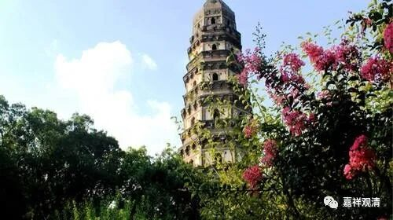

**《善说精髓》084（132）**

** “戌二、释胜义谛相**

** 分二：亥一、正义，亥二、断诤。**

** 亥一、正义”**

** **

先说自宗“胜义谛”的定义。

** **

** “对之而成理智量，为理智量所获义，**

** 胜义谛相。”**

** **

** “对之**”（它）“** 而成**”为“** 理智量**”，“** 为**”（第二声）这个“** 理智量**”“** 所获**”得的“** 义**”（境），就是“** 胜义谛**”之“** 相**”。

白话解释一下。对向它，朝向它的是“理智量”，被这个“理智量”所认知的对象，所缘的境，就是胜义谛。和世俗谛一样，那什么，我给个简短不被格西们看好的、不精确的版本：就是后面半句，“胜义理智的所缘境”。若说胜义智有“朝向如所有的智”和“朝向尽所有的智”，则此胜义谛是朝向“如所有”的智。（这大概就是前半句的来历。）

月称论师《入中论自释》中说：

** “胜义，谓是现见真义胜智所得之体性，此是一体，然非自性有。”**

宗喀巴大师《菩提道次第略论》解释说：

** “此说是能量真实义之无漏智所得，非自性有。”**

《入中论善现密义疏》则仔细辨别，“胜义”，“** 能量真实义之无漏智所得**”，是有，但不是胜义有、不是自性有，是唯名言有。这个前面我们谈到过了。所以下面：

“** 不堪忍**”；

就是说，这个胜义谛虽然是不欺诳的存在，但同样“** 不堪忍**”正理观察，经不起终极分析。上面讲过，一旦你去推求“究竟是啥”的时候，已经属于观察胜义，就是在观察他是否“终极存在”，这就是在分别他的“自性”、本质了；但事物终极的本质是“不存在”，胜义谛也一样，非“终极存在”，它的存在只能基于名言而成立。所以说：

** “诸有虽皆名言立，然非其立遍是有。”**

** **

** “诸有**”，“** 虽**”然“** 皆**”是“** 名言**”安“** 立**”而有，“** 然**”而并“** 非**”“** 其**”名言安“** 立**”的周“** 遍”“是有**”。

存在，都必然是仅仅是名言安立（胜义谛之存在也是如此）而有；但这句话反过来不成立——仅由名言安立的则未必存在——它有可能是错的。（辩论的人还是厉害啊，说话一句马上堵漏——他知道你在什么地方会想歪。）

