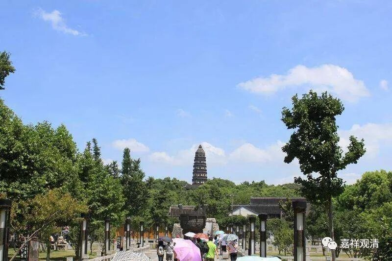

**《微课中观史》41·3**

我们来看看，与此对应的小顿悟说是怎么说的呢？到七地的时候，是一个顿悟的台阶。那么，在这个时候是七地，相对于十地最后心的金刚喻定，还差三地，所以就把它称为叫小顿悟，就是这个顿悟没有完整。

我自己是怎么看的呢？我们来聊一聊吧。这里面有一个问题就是，当时的法相名词的翻译还不是很精确，而道生法师本身可以说是悟解比较透达的一个人物，他不是拘泥于文字的。在那个时代，佛教文字的精确度本来就不是很高，因为大乘的阿毗达磨还没有很精确地、成建制地转译过来。虽然小乘的阿毗达磨已经翻译过来了，但是借用小乘的阿毗达磨来思维大乘佛法的时候，还是会有一些偏差的。

我个人比较认同的是，在七地的时候有一个顿悟，主要有两个原因。一方面，僧肇法师和道生法师我都比较推崇的，但在两个当中，我更加买僧肇大师的账。另一方面呢，七地的顿悟是指这个时候已经把烦恼断完了，按照我们现在的讲法就是把烦恼障全部断完了，这个时候就和之前有一个很大的差别。我们说的七地不是在七地最初的时候，而是在七地最后登八地的时候。

关于十地这个说法呢，你要说完全没有背景也不见得，因为在中观自续和唯识的系统当中都讲，在十地的每一地要断一品烦恼障和所知障，最后一品烦恼障也是要到十地才断的，就是最微细的烦恼的种子。就中观派的本意来说，或者中观应成派的意思来说，还是在七地最后断完所有的烦恼。这个也确实是般若经和《华严经》当中所讲的。

当然，唯识派和中观自续也是基于《华严经》和《般若经》来讲的，就有这样的差别。这个差别如果单单从十地的最后心和七地的最后心来看，好像是十地更加像大顿悟，被称为大顿悟说。

后来，这个“大顿悟”说就和原来道生法师的意思有了一点偏差——大顿悟的“顿悟成佛”、“十地以还皆是大梦”，变成了“见性成佛”。再后来，禅宗当中强调不立文字，刚才我们讲到“言尽意”和“言不尽意”，就讲到了“不立文字”，于是就有了“不立文字，见性成佛”！

