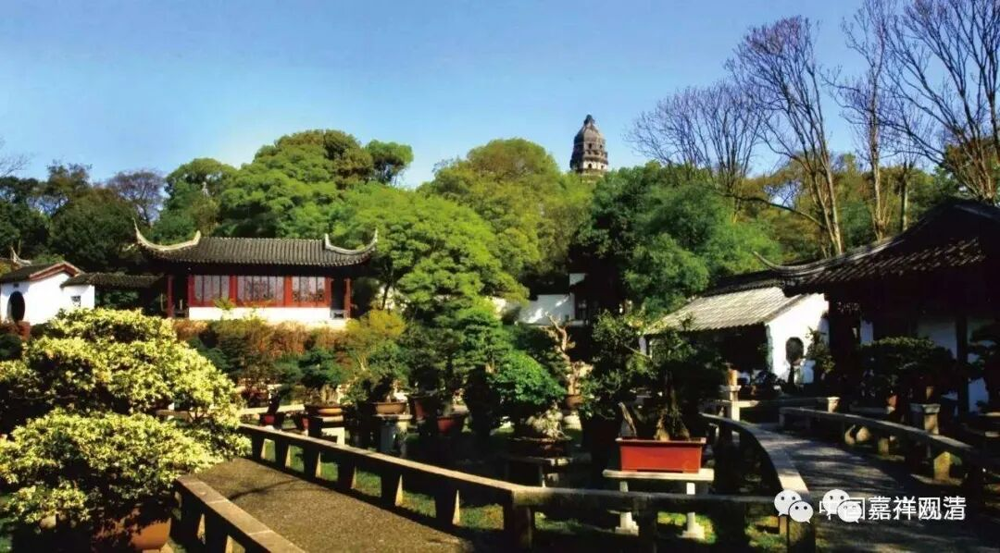

**《微课中观史》41·4**

再看一些其他的做法，比如“善不受报”，谢灵运就讲，培福报的事情，你们走在前面，升天你们在我前面，但是成佛你们在我后面。其实他还是比较强调慧解。哦，“慧解”这个词可能还不够，要讲“慧悟”，不太强调章句理解，不太强调那种文字上的理解。实际上，两汉经学到魏晋玄学的演变，就是从经文章句到义理的阐扬。

再比如，我们也可以看出，道生法师在那些同学当中脱颖而出的特点是什么呢？就是悟解，从文字背后先抓住核心内容。当然我们不敢说道生法师的其他方面（大乘阿毗达摩）就不行，放在那个时代，连僧肈法师也有类似（大乘阿毗达摩基础欠缺）的问题，这个是没办法的。当时大乘的阿毗达磨翻译得还不够，所以僧肇法师的文字也非常玄学化，比如“物物而不物于物”，大量地运用到《周易》、《论语》、《庄子》里面的一些文字。

这是什么原因呢？虽然那个时候已经不再是格义佛教，但是阿毗达磨的名词系统还没有翻译完善。所以我一直会谈到的一件事情就是，鸠摩罗什法师他自己说——我不知道应该是叫感慨或者叫伤感，他说：“很可惜我年龄大了，如果我来写一篇大乘的阿毗达磨就好了。”但是很可惜，就没有这个时间，历史没有给他这个机会……最后这件事情没有做成。由此也可以看出，当时确实缺乏大乘的，特别是中观的阿毗达磨。

这个问题应该是一直等到玄奘法师回到中国以后，对大乘的阿毗达磨的介绍才臻于完善。当然，真谛法师在此之前已经开始大量地翻译了，直到玄奘法师的时代才臻于完善。（很可惜的是，到现在，汉传佛教界也还是要解决这个问题——教界对阿毗达摩的重视程度基本可以归零。）

说起来，大乘都是以《般若经》为核心的、为桩脚的，但是关于广行的《现观庄严论》这个系统一直没有被翻译过来，一直到法尊法师的时候才完成。有一种说法说好像义净法师曾近翻译过，很可惜义净法师的很多作品都失传了。

不管怎么样，现在我们手上有法尊法师翻译的般若经的广行这部分内容，这个对于汉传佛教应该是打了一个比较大的强心针，就是不知道我们接下去能不能学得好。下个月我们要继续学习《现观庄严论》，大家有兴趣的话，可以好好学一学。

好，今天好像讲得太多了，先到这里，谢谢大家。

