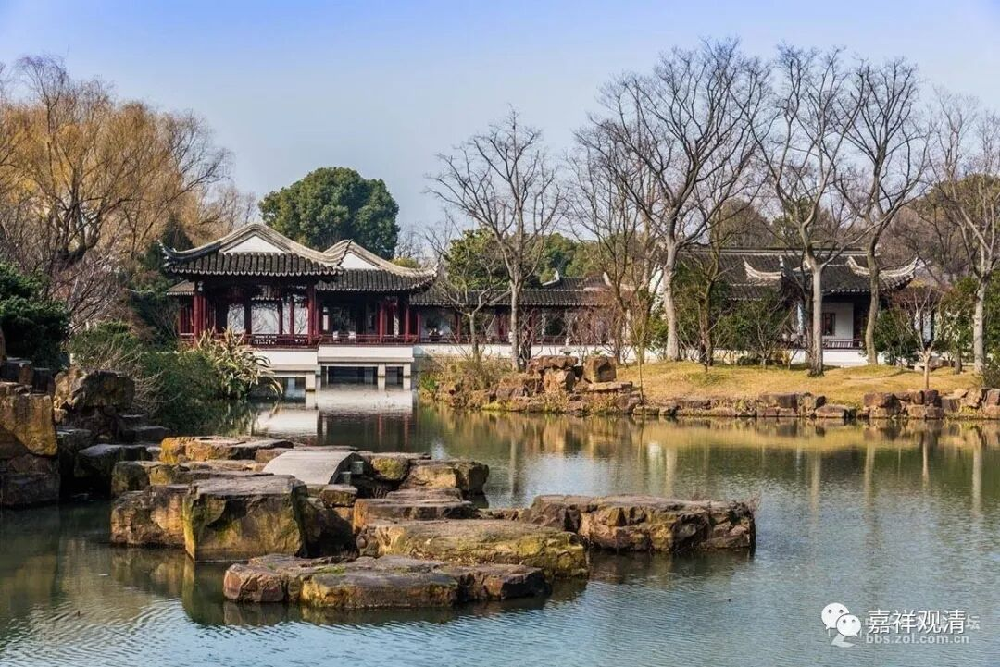

**《微课堂佛教史》043·1**

今天我们再继续佛教史，讲中国佛教的中观派历史。现在是讲到鸠摩罗什法师和他的弟子们。鸠摩罗什法师的弟子当中最重要的有“四圣、八俊、十哲”，我们主要讲了僧肇法师、僧睿法师和道生法师。

关于道生法师的内容说得稍微多了一点，因为道生法师可以说是在中国佛教史上很关键的一个人物。甚至可以说，由于他的出现导致了当时的一个学风的转变。当然，这也是和《涅槃经》的流传有点关系。也就是说，假如以僧肇法师或者后面的三论宗作为佛教中观派的嫡系的话，那么道生法师实际上已经不算是那个嫡系了。他的有些观点跟传统的三论宗或者中观派是有点距离的，他是有他自己的一些想法的。我们在前面提到过，道生法师在鸠摩罗什法师门下学习，其实待的时间并不像僧肇法师、僧睿法师那么长。

那么，鸠摩罗什法师来到中国之后，他的学派在当时被称为什么呢？后来把他的学派称为叫关河学派或者关河旧义。一般来说，我们会说他（三论宗）是中国历史上最早出现的一个宗派。当然，各个宗派都在把自己的历史往前推，是吧？有些就认为天台宗是比较早的，其实天台宗也是受到了三论系统或者说中观系统的影响，他们自己也认为属于龙树系统的。

在这个以前呢，中国佛教的私学会比较多，具有明显的师承性质的背景就比较少。可以这么说吧，正统的唯识和中观在向中国传播的过程当中呢，都出现了学派性质的学习团体，包括后来的真谛法师、菩提流支法师等等，都有很明确的师承关系或者是对教法的传承的坚持。

但是当时的学习是零零碎碎的，并且是不断地跟随着当时中国所** 流行的**一些佛教大师们的脚步，应该说当时的一些人很难有比较明确的宗派意识（真谛法师和他的弟子们在后期有）。早期的中国佛教，或者说是在唐代以前，佛教的宗派意识并不强。因为大家看到的论著也是零零散散的，翻译的经典也很难确定地说是某个流派的。

所以鸠摩罗什法师和真谛法师他们以流派为主的翻译，可以说是一种新兴的情况。那个时代经常出现的情况是，域外过来一个人，会一点汉语，或者是稍微学了一点汉语，就带着弟子们或者一帮朋友，或者经人邀请就翻译一些经典，相对来说是比较随意的。像鸠摩罗什法师和真谛法师这样成建制地翻译经典在那个时代是比较少见的。

